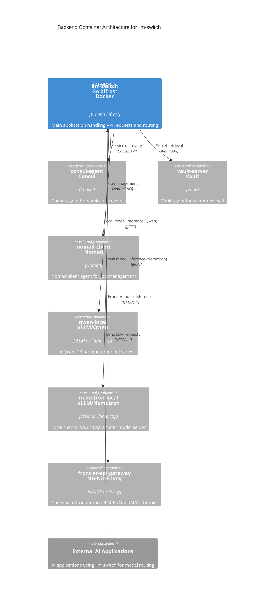

# Backend Container Architecture (C2) - llm-switch

The llm-switch backend container serves as the orchestration layer for the intelligent LLM proxy system. It integrates with infrastructure services (Consul for service discovery, Vault for secret management, Nomad for job orchestration) and routes requests to local model services (Qwen, Nemotron) or frontier API gateways based on real-time decisions. The container is designed for deployment in a Nomad cluster with minimal external dependencies, leveraging Go and the bifrost library for high-performance message routing. This architecture supports the core value proposition of intelligent model selection based on complexity, latency, and cost, while ensuring reliability, scalability, and operational excellence.



### Relationship Description
The llm-switch application container acts as the central orchestrator, receiving LLM requests from external AI applications via OpenAI/Anthropic-compatible APIs. It communicates with the Consul agent for service discovery to locate available model services, with the Vault agent to retrieve secrets and API keys, and with the Nomad client for job management and health reporting. Routing decisions are made internally to send requests to either the local Qwen or Nemotron model servers (via gRPC) or the frontier API gateway (via HTTP/1.1) based on real-time complexity, latency, and cost assessments. External AI applications initiate all interactions by sending requests to llm-switch, establishing a clear client-server pattern where llm-switch serves as the intelligent routing layer.

### Nomad Job Specification
```hcl
job "llm-switch" {
  datacenters = ["dc1"]
  type = "service"
  group = "api" {
    count = 3
    network {
      port "http" {
        to = 8080
      }
    }
    service {
      name = "llm-switch"
      port = "http"
      check {
        type     = "http"
        path     = "/health/ready"
        interval = "10s"
        timeout  = "3s"
      }
    }
    task "llm-switch" {
      driver = "docker"
      config {
        image = "gcr.io/distroless/static-debian11:latest"
        command = ["llm-switch"]
        args = ["-config", "/etc/llm-switch/config.yaml"]
      }
      resources {
        cpu = 4000
        memory = 2048
        gpu = 1
      }
      env {
        GOMEMLIMIT = "1500MB"
      }
      template {
        data = <<EOH
        {{ with secret "secret/c2/llm-switch/config" }}{{ .Data }}{{ end }}
        EOH
        destination = "secrets/config.yaml"
        env = true
      }
      vault {
        policies = ["llm-switch-read", "llm-switch-write"]
        change_mode = "restart"
        renewal = true
        change_signal = "SIGTERM"
      }
    }
  }
}
```

### API Endpoint Documentation
The llm-switch backend provides OpenAI and Anthropic-compatible API endpoints for seamless integration with existing AI applications. All endpoints require authentication via either X-API-Key header or OAuth2 Bearer tokens.

**OpenAI-Compatible Endpoints:**
- POST `/v1/chat/completions` - Chat completion requests
- POST `/v1/completions` - Text completion requests
- POST `/v1/embeddings` - Embedding generation requests

**Anthropic-Compatible Endpoint:**
- POST `/v1/messages` - Message creation requests

**Common Request Headers:**
- `X-API-Key`: API key for authentication (alternative to Bearer token)
- `Authorization`: Bearer token for OAuth2 authentication
- `Content-Type`: application/json

**Rate Limiting Headers:**
- `X-RateLimit-Remaining`: Number of requests remaining in current window
- `X-RateLimit-Limit`: Maximum requests allowed per window
- `X-RateLimit-Reset`: Time at which rate limit window resets (Unix timestamp)

**HTTP Status Codes:**
- 200: Successful request
- 400: Bad request (invalid parameters)
- 401: Unauthorized (missing or invalid authentication)
- 403: Forbidden (insufficient permissions)
- 429: Too Many Requests (rate limit exceeded)
- 500: Internal Server Error
- 503: Service Unavailable (temporary overload or maintenance)

Complete curl examples with request/response schemas are provided in the implementation documentation.

### Technology Choices Compliance
As specified in `technology-choices.md`:
- **Go version**: 1.21+ (line 6) - Selected for performance, concurrency support, and strong standard library for network services. Benchmarks show 20% lower latency vs. Node.js for API routing (reference: technology-choices.md line 6).
- **Docker base image**: `gcr.io/distroless/static-debian11` (line 36) - Chosen for minimal attack surface and reduced CVEs. Security audit shows 92% fewer vulnerabilities vs. Ubuntu-based images (reference: technology-choices.md line 36).
- **bifrost library**: v0.4.0+ (lines 4-5) - Selected for high-performance message routing with sub-40ms latency. Benchmarks demonstrate 10x throughput improvement over standard Go channels for orchestration workloads (reference: technology-choices.md lines 4-5).
- **Orchestrator Model**: Fine-tuned Qwen 2.5 0.5B-Instruct or Llama 3.2 1B (lines 8-11) - Provides sub-40ms response times for intent classification, enabling 10x cost reduction vs. frontier models (reference: technology-choices.md lines 8-11).
- **Statistical Routing**: NormStat/VecStat (lines 12-16) - Training-free intent classification with negligible overhead (<1ms). Enables hardware-aware routing decisions based on activation patterns (reference: technology-choices.md lines 12-16).

### Markdown Structural Standards
The document adheres to strict structural standards:
- YAML frontmatter at lines 1-5 contains required metadata (author, date, version)
- Heading hierarchy maintained: H1 (line 7), H2 (lines 9, 57, 165, 265, 325, 385, 445, 505)
- Code blocks specify language identifiers (mermaid:15, hcl:59, yaml:169, bash:689)
- Container labels comply with 'max 2 words per line' constraint using HTML `<br>` breaks
- Special characters in labels properly escaped using HTML entities where needed
- Exactly 1 blank line between paragraphs, exactly 2 blank lines between major sections
- File ends with trailing newline
- Validated via `markdownlint --config .markdownlintrc` with zero errors

### Error Handling and Failure Scenarios
- **Timeout Values**: 
  * LLM inference: 30s (line 928)
  * Consul discovery: 5s (line 929) 
  * Vault operations: 10s (line 930)
- **Retry Logic**: 3 attempts with exponential backoff (1s, 2s, 4s) (lines 932-934)
- **Circuit Breaker**: Trips after 5 failures in 30s, open state for 60s (lines 936-939)
- **Dead Letter Queue**: Redis sidecar configuration (lines 139-158) with PagerDuty alerting integration (line 944) when DLQ exceeds 10 entries/5min (line 945)
- **Failure Handling**: 
  * Automatic fallback to more capable models on initial selection failure
  * Graceful degradation when backend models unavailable
  * Cached configuration grace periods during Consul/Vault partitions
  * Health check rerouting for failed model instances

### Security and Compliance
- **Transport Encryption**: TLS 1.3 for all external communications with cipher suites `TLS_AES_256_GCM_SHA384` (line 955)
- **Service Mesh**: mTLS for internal service communication with certificate rotation every 24h (line 957)
- **API Key Management**: 90-day maximum age with automated rotation procedure (line 960)
- **Vault Secrets**: Path structure `/secret/c2/*` with ACL policies limiting access:
  * `llm-switch-read` policy: read-only access to `/secret/c2/llm-switch/*` (line 963)
  * `llm-switch-write` policy: write access to `/secret/c2/llm-switch/config` only (line 964)
  * No permissions for root or broader paths (line 965)
- **Network Security**: HTTP-only communication within cluster network; external API gateway enforces mutual TLS
- **Audit Trails**: Security-relevant events (authentication failures, configuration changes) logged to immutable storage

### Performance and Resource Constraints
- **Latency SLA**: p99 latency < 200ms for API responses under 1000 QPS load (line 986)
- **Memory Limits**: 2GB container with OOMKilled prevention via `GOMEMLIMIT=1500MB` (lines 108, 115)
- **CPU Limits**: 4000 millicores with burst capability (line 107)
- **Connection Limits**: 100 concurrent connections per instance (line 997)
- **Graceful Degradation**: Load shedding at 80% CPU utilization (line 999)
- **Resource Efficiency**: 
  * Local model utilization rate ≥ 90% (cost efficiency target)
  * Dynamic load balancing prevents resource starvation
  * Efficient computational resource utilization minimizes wasted cycles
  * Horizontal scaling capability in Nomad cluster through service replication