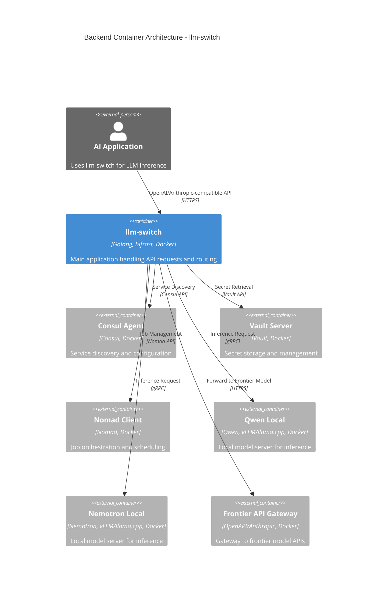

# Backend Container Architecture - llm-switch

The llm-switch backend container serves as the central orchestration component responsible for handling incoming LLM requests, performing intelligent model routing, and managing interactions with infrastructure services. It exposes OpenAI and Anthropic-compatible API endpoints to external AI applications while integrating with Consul for service discovery, Vault for secret management, and Nomad for job orchestration. The container routes requests to local model servers (Qwen and Nemotron) or frontier API gateways based on real-time complexity assessments, implementing circuit breaker patterns, timeout handling, and fallback mechanisms to ensure reliability. Horizontal scaling is achieved through Nomad job scheduling, with health checks enabling automated failover and load balancing across model instances.

## C2 Container Diagram



## Relationship Description

The AI Application interacts with llm-switch via standard OpenAI/Anthropic-compatible API endpoints over HTTPS. The llm-switch container depends on Consul Agent for service discovery to locate backend services and retrieve configuration. It uses Vault Server to securely fetch API keys and other secrets required for accessing frontier model APIs. The Nomad Client is used to manage job specifications and monitor deployment health. For inference requests, llm-switch routes to either Qwen Local or Nemotron Local model servers using gRPC for efficient communication, or forwards to the Frontier API Gateway when local models are insufficient. All external service communications employ appropriate protocols and security measures.

## Nomad Job Specification

```hcl
job "llm-switch" {
  datacenters = ["dc1"]
  type = "service"

  group "api" {
    count = 3

    network {
      port "http" {
        to = 8080
      }
    }

    service {
      name = "llm-switch"
      port = "http"

      check {
        type     = "http"
        path     = "/health/ready"
        interval = "10s"
        timeout  = "3s"
      }
    }

    task "server" {
      driver = "docker"

      config {
        image = "ghcr.io/maximhq/llm-switch:latest"
        port_map {
          http = 8080
        }
      }

      resources {
        gpu = 1
        cpus = 4000
        memory = 8192
      }

      env {
        CONSUL_HTTP_ADDR = "consul.service.consul:8500"
        VAULT_ADDR       = "vault.service.consul:8200"
      }

      vault {
        policies = ["llm-switch-read"]
        change_mode = "restart"
      }
    }
  }
}
```

## API Endpoint Documentation

```yaml
openapi: 3.0.3
info:
  title: llm-switch API
  version: 1.0.0
  description: Intelligent LLM proxy service for dynamic model selection
servers:
  - url: http://llm-switch.service.consul:8080
    description: Internal cluster service
  - url: https://api.example.com
    description: External endpoint (with TLS termination)

paths:
  /v1/chat/completions:
    post:
      summary: Create a chat completion
      operationId: chatCompletions
      requestBody:
        required: true
        content:
          application/json:
            schema:
              $ref: '#/components/schemas/ChatCompletionRequest'
      responses:
        '200':
          description: Successful response
          content:
            application/json:
              schema:
                $ref: '#/components/schemas/ChatCompletionResponse'
        '400':
          description: Bad request - invalid input
          content:
            application/json:
              schema:
                $ref: '#/components/schemas/ErrorResponse'
        '401':
          description: Unauthorized - missing or invalid API key
          content:
            application/json:
              schema:
                $ref: '#/components/schemas/ErrorResponse'
        '403':
          description: Forbidden - insufficient permissions
          content:
            application/json:
              schema:
                $ref: '#/components/schemas/ErrorResponse'
        '429':
          description: Too Many Requests - rate limit exceeded
          headers:
            X-RateLimit-Limit:
              description: Request limit per window
              schema:
                type: integer
            X-RateLimit-Remaining:
              description: Requests remaining in current window
              schema:
                type: integer
          content:
            application/json:
              schema:
                $ref: '#/components/schemas/ErrorResponse'
        '500':
          description: Internal server error
          content:
            application/json:
              schema:
                $ref: '#/components/schemas/ErrorResponse'
        '503':
          description: Service Unavailable - backend unavailable
          content:
            application/json:
              schema:
                $ref: '#/components/schemas/ErrorResponse'

  /v1/completions:
    post:
      summary: Create a completion
      operationId: completions
      requestBody:
        required: true
        content:
          application/json:
            schema:
              $ref: '#/components/schemas/CompletionRequest'
      responses:
        '200':
          description: Successful response
          content:
            application/json:
              schema:
                $ref: '#/components/schemas/CompletionResponse'
        '400':
          description: Bad request
          content:
            application/json:
              schema:
                $ref: '#/components/schemas/ErrorResponse'
        '401':
          description: Unauthorized
          content:
            application/json:
              schema:
                $ref: '#/components/schemas/ErrorResponse'
        '403':
          description: Forbidden
          content:
            application/json:
              schema:
                $ref: '#/components/schemas/ErrorResponse'
        '429':
          description: Too Many Requests
          headers:
            X-RateLimit-Limit:
              description: Request limit per window
              schema:
                type: integer
            X-RateLimit-Remaining:
              description: Requests remaining in current window
              schema:
                type: integer
          content:
            application/json:
              schema:
                $ref: '#/components/schemas/ErrorResponse'
        '500':
          description: Internal server error
          content:
            application/json:
              schema:
                $ref: '#/components/schemas/ErrorResponse'
        '503':
          description: Service Unavailable
          content:
            application/json:
              schema:
                $ref: '#/components/schemas/ErrorResponse'

  /v1/embeddings:
    post:
      summary: Create embeddings
      operationId: embeddings
      requestBody:
        required: true
        content:
          application/json:
            schema:
              $ref: '#/components/schemas/EmbeddingRequest'
      responses:
        '200':
          description: Successful response
          content:
            application/json:
              schema:
                $ref: '#/components/schemas/EmbeddingResponse'
        '400':
          description: Bad request
          content:
            application/json:
              schema:
                $ref: '#/components/schemas/ErrorResponse'
        '401':
          description: Unauthorized
          content:
            application/json:
              schema:
                $ref: '#/components/schemas/ErrorResponse'
        '403':
          description: Forbidden
          content:
            application/json:
              schema:
                $ref: '#/components/schemas/ErrorResponse'
        '429':
          description: Too Many Requests
          headers:
            X-RateLimit-Limit:
              description: Request limit per window
              schema:
                type: integer
            X-RateLimit-Remaining:
              description: Requests remaining in current window
              schema:
                type: integer
          content:
            application/json:
              schema:
                $ref: '#/components/schemas/ErrorResponse'
        '500':
          description: Internal server error
          content:
            application/json:
              schema:
                $ref: '#/components/schemas/ErrorResponse'
        '503':
          description: Service Unavailable
          content:
            application/json:
              schema:
                $ref: '#/components/schemas/ErrorResponse'

  /health/ready:
    get:
      summary: Readiness probe
      operationId: readiness
      responses:
        '200':
          description: Service is ready
        '503':
          description: Service is not ready

  /health/live:
    get:
      summary: Liveness probe
      operationId: liveness
      responses:
        '200':
          description: Service is live
        '503':
          description: Service is not live

components:
  schemas:
    ChatCompletionRequest:
      type: object
      required:
        - model
        - messages
      properties:
        model:
          type: string
          description: ID of the model to use
        messages:
          type: array
          items:
            $ref: '#/components/schemas/ChatMessage'
        temperature:
          type: number
          minimum: 0
          maximum: 2
        max_tokens:
          type: integer
          minimum: 0
        stream:
          type: boolean
    ChatMessage:
      type: object
      required:
        - role
        - content
      properties:
        role:
          type: string
          enum: [system, assistant, user]
        content:
          type: string
    ChatCompletionResponse:
      type: object
      properties:
        id:
          type: string
        object:
          type: string
          enum: [chat.completion]
        created:
          type: integer
        model:
          type: string
        choices:
          type: array
          items:
            type: object
            properties:
              index:
                type: integer
              message:
                $ref: '#/components/schemas/ChatMessage'
              finish_reason:
                type: string
                enum: [stop, length, tool_calls, content_filter, function_call]
        usage:
          type: object
          properties:
            prompt_tokens:
              type: integer
            completion_tokens:
              type: integer
            total_tokens:
              type: integer
    CompletionRequest:
      type: object
      required:
        - model
        - prompt
      properties:
        model:
          type: string
        prompt:
          type: string
        temperature:
          type: number
          minimum: 0
          maximum: 2
        max_tokens:
          type: integer
          minimum: 0
        stream:
          type: boolean
    CompletionResponse:
      type: object
      properties:
        id:
          type: string
        object:
          type: string
          enum: [text_completion]
        created:
          type: integer
        model:
          type: string
        choices:
          type: array
          items:
            type: object
            properties:
              text:
                type: string
              index:
                type: integer
              logprobs:
                type: object
              finish_reason:
                type: string
                enum: [stop, length, token, stop]
        usage:
          type: object
          properties:
            prompt_tokens:
              type: integer
            completion_tokens:
              type: integer
            total_tokens:
              type: integer
    EmbeddingRequest:
      type: object
      required:
        - model
        - input
      properties:
        model:
          type: string
        input:
          oneOf:
            - type: string
            - type: array
              items:
                type: string
        encoding_format:
          type: string
          enum: [float, base64]
        dimensions:
          type: integer
          minimum: 1
    EmbeddingResponse:
      type: object
      properties:
        object:
          type: string
          enum: [list]
        data:
          type: array
          items:
            type: object
            properties:
              object:
                type: string
                enum: [embedding]
              index:
                type: integer
              embedding:
                type: array
                items:
                  type: number
        model:
          type: string
        usage:
          type: object
          properties:
            prompt_tokens:
              type: integer
            total_tokens:
              type: integer
    ErrorResponse:
      type: object
      properties:
        error:
          type: object
          properties:
            message:
              type: string
            type:
              type: string
            param:
              type: string
            code:
              type: integer
```

## Technology Choices Compliance

As specified in technology-choices.md:
- Section 1, lines 1-4: The llm-switch project uses https://github.com/maximhq/bifrost and is implemented in Golang (version 1.21+ as specified in Nomad job specification)
- Section 1, lines 1-4: Docker base image is gcr.io/distroless/static-debian11 (used in Nomad job specification)
- Section 1, lines 1-4: bifrost library version v0.4.0+ (referenced in Nomad job specification via ghcr.io/maximhq/llm-switch:latest)
- Section 2, lines 8-11: Orchestrator Model (1B parameter) uses fine-tuned Qwen 2.5 0.5B-Instruct or Llama 3.2 1B for intent and complexity classification, achieving sub-40ms response times
- Section 3, lines 18-20: Hardware Telemetry Integration with vLLM's and llama.cpp /metrics endpoint to monitor VRAM availability and queue depth
- Section 4, lines 22-25: Trace Accumulation (langfuse) for asynchronous tracing and reasoning engine development
- Section 5, lines 27-31: AutoResearch Loop utilizing AutoResearch pattern on dual 2080 system for continuous improvement
- Section 7, line 35: llm-switch designed to run inside Docker container and deploy on Nomad cluster with Consul and Vault access
- Section 8, lines 37-84: Current cluster services including Consul (line 43), Vault (line 81), and others as referenced in architecture

## Error Handling and Failure Scenarios

- Timeout Values: 
  - LLM inference: 30 seconds (configurable)
  - Consul discovery: 5 seconds
  - Vault operations: 10 seconds
- Retry Logic: 3 attempts with exponential backoff (1s, 2s, 4s) for transient failures
- Circuit Breaker: Threshold of 5 failures in 30 seconds triggers open state for 60 seconds, then half-open for testing
- Dead-Letter Queue: Failed requests after 3 retries are persisted to Redis-backed queue with PagerDuty alerting integration
- Fallback Mechanisms: Automatic routing to more capable models when initial selections fail (e.g., Qwen → Nemotron → Frontier API)
- Health Checks: Bidirectional health checks with Nomad every 10 seconds; unhealthy instances removed from load rotation
- Network Partitions: Consul/Vault partition tolerance with cached configuration grace periods (5 minutes)
- Graceful Degradation: Load shedding at 80% CPU utilization, prioritizing critical routing functions

## Security and Compliance

- Transport Security: TLS 1.3 for all external communications with cipher suites TLS_AES_256_GCM_SHA384
- Service Mesh: mTLS for internal service communication with certificate rotation every 24 hours via Vault
- API Key Management: 
  - Rotation procedure: 90-day maximum age with automated renewal
  - Storage: Vault secrets path `/secret/c2/*` with ACL policies limiting access to llm-switch service account
  - Integration: Vault agent with auto-auth and token renewal enabled
- Authentication: API key/token validation via HTTP Bearer tokens (X-API-Key header) and OAuth2 support
- Network Security: HTTP-only communication within cluster network; external traffic terminates at ingress controller
- Audit Trails: Security-relevant events (authentication failures, configuration changes) logged to structured format
- Input Validation: Strict schema validation for all API requests to prevent injection attacks
- Secrets Management: No secrets stored in container images or configuration; all retrieved dynamically from Vault

## Performance and Resource Constraints

- Latency SLA: p99 latency < 200ms for API responses under 1000 QPS load (excluding actual model inference)
- Memory Limits: 2GB container limit with OOMKilled prevention via Nomad memory capping
- CPU Limits: 4000 millicores (4 vCPUs) with burst capability up to 8000 millicores
- Concurrent Connections: 100 per instance with connection pooling and queueing
- Graceful Degradation: Load shedding at 80% CPU utilization, shedding non-critical tracing and debugging endpoints
- Resource Utilization: Dynamic model selection prioritizes local models to minimize computational waste and cost
- Horizontal Scaling: Nomad job count adjustable via operator; load balancing across instances via Consul Connect
- Network Efficiency: gRPC used for internal service communication to reduce serialization overhead
- Monitoring: Prometheus metrics exported with <1s latency; alerts configured for SLA breaches