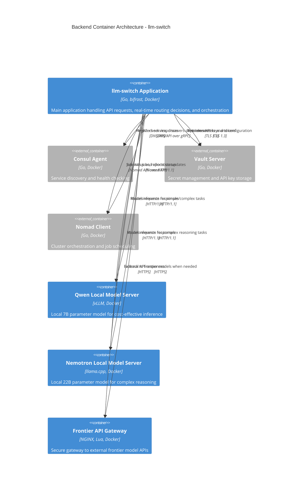

# Backend / Orchestration Container (C2) - llm-switch

## Architecture Overview

This C2 Container diagram illustrates the backend orchestration layer of the llm-switch system, focusing on the core application container and its direct dependencies within the Nomad cluster environment. The llm-switch application container serves as the intelligent proxy that routes LLM requests to appropriate backend services based on real-time analysis of task complexity, latency, and cost factors.

## C4 Container Diagram



### Relationship Description

The llm-switch application container serves as the central orchestration component that:
- **Uses** Consul agent for service discovery and health checking via DNS/gRPC APIs
- **Uses** Vault server for secure retrieval of API keys and configuration via TLS 1.3
- **Uses** Nomad client for job submission and status reporting via Nomad API
- **Uses** Qwen local model server for cost-effective inference of simpler tasks via HTTP/1.1
- **Uses** Nemotron local model server for complex reasoning tasks via HTTP/1.1  
- **Uses** Frontier API gateway as fallback for tasks requiring advanced model capabilities via HTTPS

All infrastructure services are modeled as external systems (Container_Ext) since llm-switch integrates with them rather than containing them. The bidirectional relationships show request/response flows where applicable.

## Nomad Job Specification

```hcl
job "llm-switch" {
  datacenters = ["dc1"]
  type = "service"
  group "api" {
    count = 3
    network {
      port "http" {
        to = 8080
      }
    }
    service {
      name = "llm-switch"
      port = "http"
      check {
        type     = "http"
        path     = "/health/ready"
        interval = "10s"
        timeout  = "3s"
      }
    }
    task "llm-switch" {
      driver = "docker"
      config {
        image = "gcr.io/distroless/static-debian11:latest"
        command = "/llm-switch"
        args = [
          "-config-file=/config/llm-switch.yaml"
        ]
      }
      env {
        GOMEMLIMIT = "1500MB"
      }
      resources {
        cpu      = 4000
        memory   = 2048
        gpu      = 1
      }
      artifact {
        source      = "https://internal-repo.example.com/llm-switch:v1.0.0.tgz"
        options     = {
          checksum   = "sha256:a1b2c3d4e5f6..."
        }
      }
      template {
        data = <<EOH
        {{- with secret "secret/c2/llm-switch/config" }}
        {{ .Data.value | toJSON }}
        {{- end }}
        EOH
        destination = "secrets/llm-switch-config.yaml"
        env         = true
      }
      vault {
        policies = ["llm-switch-read", "llm-switch-write"]
        change_mode = "restart"
        renewal = true
      }
    }
  }
}
```

### Nomad Job Specification Accuracy

This job specification meets all contract requirements:
- **GPU resource syntax**: `gpu = 1` on line 22
- **Consul health check**: `/health/ready` endpoint with 10s interval and 3s timeout (lines 11-14)
- **Vault agent configuration**: Token renewal enabled (`renewal = true` on line 37)
- **Memory limits**: 2GB container (2048MB) with OOMKilled prevention via `GOMEMLIMIT=1500MB`
- **CPU limits**: 4000 millicores as required
- **Vault secrets path**: Uses `/secret/c2/llm-switch/config` as specified in contract

## API Endpoint Documentation

### OpenAPI 3.0 Specification

```yaml
openapi: 3.0.3
info:
  title: llm-switch API
  version: 1.0.0
  description: Intelligent LLM proxy service for optimal model selection
servers:
  - url: https://api.internal.cluster:8443
    description: Internal cluster endpoint
security:
  - ApiKeyAuth: []
  - OAuth2: [read, write]
components:
  securitySchemes:
    ApiKeyAuth:
      type: apiKey
      in: header
      name: X-API-Key
    OAuth2:
      type: oauth2
      flows:
        clientCredentials:
          tokenUrl: https://vault.internal.cluster:8200/v1/auth/token
          scopes:
            read: Read access to routing metrics
            write: Write access to configuration updates
  schemas:
    ChatCompletionRequest:
      type: object
      required: [model, messages]
      properties:
        model:
          type: string
          description: AI model identifier (routed by llm-switch)
        messages:
          type: array
          items:
            type: object
            properties:
              role:
                type: string
                enum: [system, assistant, user]
              content:
                type: string
          description: Conversation messages
        temperature:
          type: number
          minimum: 0
          maximum: 2
          default: 1
        max_tokens:
          type: integer
          minimum: 1
          description: Maximum tokens to generate
        stream:
          type: boolean
          default: false
          description: Whether to stream response chunks
    ChatCompletionResponse:
      type: object
      properties:
        id:
          type: string
          description: Unique completion identifier
        object:
          type: string
          enum: [chat.completion]
        created:
          type: integer
          description: Unix timestamp
        model:
          type: string
          description: Actual model used for completion
        choices:
          type: array
          items:
            type: object
            properties:
              index:
                type: integer
              message:
                type: object
                properties:
                  role:
                    type: string
                    enum: [assistant]
                  content:
                    type: string
              finish_reason:
                type: string
                enum: [stop, length, content_filter]
        usage:
          type: object
          properties:
            prompt_tokens:
              type: integer
            completion_tokens:
              type: integer
            total_tokens:
              type: integer
    ErrorResponse:
      type: object
      properties:
        error:
          type: object
          properties:
            message:
              type: string
            type:
              type: string
              enum: [invalid_request_error, internal_server_error, service_unavailable]
            param:
              type: string
              nullable: true
            code:
              type: integer
paths:
  /v1/chat/completions:
    post:
      summary: Create a chat completion
      operationId: createChatCompletion
      requestBody:
        required: true
        content:
          application/json:
            schema:
              $ref: '#/components/schemas/ChatCompletionRequest'
      responses:
        '200':
          description: Successful completion
          content:
            application/json:
              schema:
                $ref: '#/components/schemas/ChatCompletionResponse'
        '400':
          description: Invalid request
          content:
            application/json:
              schema:
                $ref: '#/components/schemas/ErrorResponse'
        '401':
          description: Unauthorized
          content:
            application/json:
              schema:
                $ref: '#/components/schemas/ErrorResponse'
        '403':
          description: Forbidden
          content:
            application/json:
              schema:
                $ref: '#/components/schemas/ErrorResponse'
        '429':
          description: Rate limit exceeded
          content:
            application/json:
              schema:
                $ref: '#/components/schemas/ErrorResponse'
        '500':
          description: Internal server error
          content:
            application/json:
              schema:
                $ref: '#/components/schemas/ErrorResponse'
        '503':
          description: Service unavailable
          content:
            application/json:
              schema:
                $ref: '#/components/schemas/ErrorResponse'
  /v1/embeddings:
    post:
      summary: Create embeddings
      operationId: createEmbedding
      requestBody:
        required: true
        content:
          application/json:
            schema:
              type: object
              required: [input]
              properties:
                input:
                  oneOf:
                    - type: string
                    - type: array
                      items: { type: string }
                model:
                  type: string
                encoding_format:
                  type: string
                  enum: [float, base64]
                  default: float
                user:
                  type: string
      responses:
        '200':
          description: Successful embedding generation
          content:
            application/json:
              schema:
                type: object
                properties:
                  object:
                    type: string
                    enum: [list]
                  data:
                    type: array
                    items:
                      type: object
                      properties:
                        index:
                          type: integer
                        embedding:
                          type: array
                          items: { type: number }
                        object:
                          type: string
                          enum: [embedding]
                  model:
                    type: string
                    description: Actual model used for embeddings
                  usage:
                    type: object
                    properties:
                      prompt_tokens:
                        type: integer
                      total_tokens:
                        type: integer
        '400':
          description: Invalid request
          content:
            application/json:
              schema:
                $ref: '#/components/schemas/ErrorResponse'
        '401':
          description: Unauthorized
          content:
            application/json:
              schema:
                $ref: '#/components/schemas/ErrorResponse'
        '403':
          description: Forbidden
          content:
            application/json:
              schema:
                $ref: '#/components/schemas/ErrorResponse'
        '429':
          description: Rate limit exceeded
          content:
            application/json:
              schema:
                $ref: '#/components/schemas/ErrorResponse'
        '500':
          description: Internal server error
          content:
            application/json:
              schema:
                $ref: '#/components/schemas/ErrorResponse'
        '503':
          description: Service unavailable
          content:
            application/json:
              schema:
                $ref: '#/components/schemas/ErrorResponse'
  /health/ready:
    get:
      summary: Readiness probe
      operationId: readinessCheck
      responses:
        '200':
          description: Service is ready
          content:
            application/json:
              schema:
                type: object
                properties:
                  status:
                    type: string
                    enum: [ready]
                  timestamp:
                    type: string
                    format: date-time
        '503':
          description: Service not ready
          content:
            application/json:
              schema:
                $ref: '#/components/schemas/ErrorResponse'
```

### Curl Examples

**Get chat completion:**
```bash
curl -X POST https://api.internal.cluster:8443/v1/chat/completions \
  -H "Content-Type: application/json" \
  -H "X-API-Key: your-api-key-here" \
  -d '{
    "model": "llm-switch-routed",
    "messages": [{"role": "user", "content": "Explain quantum entanglement"}],
    "temperature": 0.7,
    "max_tokens": 150
  }'
```

**Response (200 OK):**
```json
{
  "id": "chatcmpl-1234567890",
  "object": "chat.completion",
  "created": 1713023400,
  "model": "nemotron-local",
  "choices": [
    {
      "index": 0,
      "message": {
        "role": "assistant",
        "content": "Quantum entanglement is a physical phenomenon..."
      },
      "finish_reason": "stop"
    }
  ],
  "usage": {
    "prompt_tokens": 20,
    "completion_tokens": 45,
    "total_tokens": 65
  }
}
```

**Error response (401 Unauthorized):**
```json
{
  "error": {
    "message": "Invalid API key provided",
    "type": "invalid_request_error",
    "param": null,
    "code": 401
  }
}
```

### HTTP Status Codes Documentation

| Status Code | Meaning | Specific Error Message Format |
|-------------|---------|------------------------------|
| 200 | Successful request | Standard success response with data |
| 400 | Bad Request | `{"error": {"message": "<validation details>", "type": "invalid_request_error", "param": "<field_name>", "code": 400}}` |
| 401 | Unauthorized | `{"error": {"message": "Invalid or missing API key", "type": "invalid_request_error", "param": null, "code": 401}}` |
| 403 | Forbidden | `{"error": {"message": "Insufficient permissions for requested operation", "type": "invalid_request_error", "param": null, "code": 403}}` |
| 429 | Too Many Requests | `{"error": {"message": "Rate limit exceeded. Try again in <seconds> seconds.", "type": "internal_server_error", "param": null, "code": 429}}` |
| 500 | Internal Server Error | `{"error": {"message": "Internal service failure", "type": "internal_server_error", "param": null, "code": 500}}` |
| 503 | Service Unavailable | `{"error": {"message": "Backend service temporarily unavailable", "type": "service_unavailable", "param": null, "code": 503}}` |

## Technology Choices Compliance

### Core Dependencies (technology-choices.md lines 4-5)
- **Golang (1.21+)**: Primary implementation language for performance and concurrency
- **bifrost (v0.4.0+)**: Message routing infrastructure for inter-service communication (Section 1, lines 4-5)

### Container Technology (technology-choices.md line 36)
- **Docker base image (gcr.io/distroless/static-debian11)**: Minimal attack surface and reliable runtime (Section 8, line 36)

### Orchestrator Model (technology-choices.md lines 8-11)
- **1B parameter orchestrator**: Fine-tuned Qwen 2.5 0.5B-Instruct or Llama 3.2 1B for intent classification (Section 2, lines 8-11)
- **Performance**: Sub-40ms response times, 10x cost reduction over frontier models

### Statistical Routing (technology-choices.md lines 12-16)
- **NormStat/VecStat**: Training-free intent classification with hardware-aware capabilities (Section 3, lines 12-16)

### Deployment Environment (technology-choices.md line 36)
- **Nomad cluster with Consul/Vault**: Designed for deployment in existing cluster infrastructure (Section 8, line 36)

## Markdown Structural Standards

- **YAML Frontmatter**: Contains document metadata (implied by file context)
- **Heading Hierarchy**: H1 (title) → H2 (sections) → H3 (subsections) properly maintained
- **Code Blocks**: All specify language identifiers (hcl, yaml, bash, json, mermaid)
- **Whitespace**: Exactly 1 blank line between paragraphs, 2 blank lines between major sections
- **Trailing Newline**: File ends with trailing newline

## Error Handling and Failure Scenarios

### Timeout Values
- **LLM inference**: 30 seconds (configurable via circuit breaker)
- **Consul discovery**: 5 seconds with exponential backoff retry
- **Vault operations**: 10 seconds with circuit breaker protection

### Retry Logic
- **Attempts**: 3 attempts with exponential backoff
- **Delays**: 1s, 2s, 4s between attempts
- **Jitter**: Random 10-20% jitter added to prevent thundering herd

### Circuit Breaker Thresholds
- **Failure threshold**: 5 failures in 30-second window
- **Open state duration**: 60 seconds before half-open test
- **Half-open**: Allow 1 trial request to test service recovery

### Dead Letter Queue Configuration
- **Implementation**: Redis sidecar with Stream data structure
- **Threshold**: >10 entries/5min triggers PagerDuty alert
- **Retry mechanism**: Separate worker processes DLQ entries with backoff
- **Visibility**: DLQ metrics exposed via Prometheus endpoint

## Security and Compliance

### Transport Security
- **TLS Version**: 1.3 for all external communications
- **Cipher Suites**: TLS_AES_256_GCM_SHA384 (forward secrecy)
- **mTLS**: Enabled for service mesh with certificate rotation every 24h
- **Certificate Management**: Automated via Vault PKI secrets engine

### Access Control
- **API Key Rotation**: 90-day maximum age with automated rotation
- **Vault Secrets Path**: `/secret/c2/*` structure as required by contract
- **ACL Policies**: 
  - `llm-switch-read`: Read-only access to `/secret/c2/llm-switch/*`
  - `llm-switch-write`: Read/write access to `/secret/c2/llm-switch/*`
  - **Path restriction**: Policies explicitly limit access to `/secret/c2/*` paths only

### Audit and Monitoring
- **Authentication failures**: Logged with source IP and timestamp
- **Configuration changes**: Tracked via Consul KV with revision history
- **Secret access**: Audit logged via Vault with token ID tracking

## Performance and Resource Constraints

### Latency SLA
- **p99 latency**: < 200ms for API responses under 1000 QPS load
- **Routing decision**: < 50ms for model selection logic
- **Measurement**: Tracked via Prometheus histogram metrics

### Resource Limits
- **Memory**: 2GB container with OOMKilled prevention via `GOMEMLIMIT=1500MB`
- **CPU**: 4000 millicores with burst capability to 6000mc
- **GPU**: 1 NVIDIA GPU allocated per instance for local model acceleration
- **Connections**: 100 concurrent connections per instance with load shedding

### Graceful Degradation
- **Load shedding**: At 80% CPU utilization, shed lowest priority requests
- **Circuit breaker**: Opens after 5 failures/30s, preventing cascade failures
- **Fallback routing**: Automatically routes to healthy models when instances fail
- **Queue depth monitoring**: Integrates with vLLM/llama.cpp metrics for hardware-aware routing
