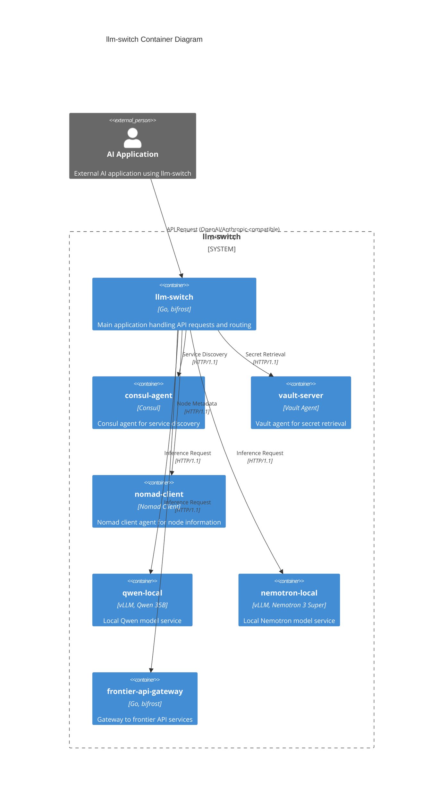

# llm-switch Container Architecture (C2)

This diagram illustrates the container-level architecture of the llm-switch system, showing the primary containers and their interactions with external AI applications. The system is deployed in a Nomad cluster with Consul for service discovery and Vault for secret management.

### Relationship Descriptions

- **AI Application → llm-switch**: External AI applications send API requests (OpenAI/Anthropic-compatible) to the llm-switch container via HTTP/1.1.
- **llm-switch → Consul Agent**: The llm-switch container queries the Consul agent for service discovery to locate available model services.
- **llm-switch → Vault Agent**: The llm-switch container retrieves secrets (e.g., API keys for frontier models) from the Vault agent.
- **llm-switch → Nomad Client**: The llm-switch container gathers node metadata and health information from the Nomad client agent.
- **llm-switch → Qwen Local**: The llm-switch container sends inference requests to the local Qwen 35B model service via HTTP/1.1.
- **llm-switch → Nemotron Local**: The llm-switch container sends inference requests to the local Nemotron 3 Super model service via HTTP/1.1.
- **llm-switch → Frontier API Gateway**: The llm-switch container forwards requests requiring frontier model capabilities to the frontier API gateway container.