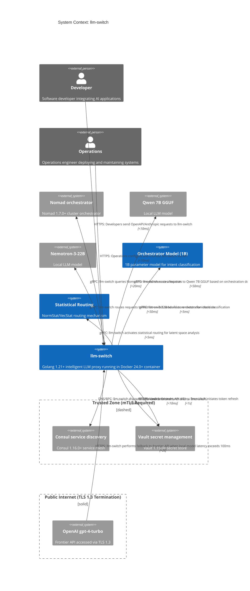

# C1 System Context: llm-switch

llm-switch implements a two-part autonomous learning architecture combining real-time intelligent model selection with offline self-learning to continuously improve routing decisions without ongoing manual intervention. This directly supports the user journeys described in PRD Section 4.2: developers integrate by redirecting API calls to llm-switch, benefiting from automatic model selection based on complexity, latency, and cost without requiring code changes; operations engineers deploy in the Nomad cluster using Consul for service discovery and Vault for secret management of API credentials. The system provides a Prometheus metrics endpoint at /metrics for monitoring and integrates with Grafana dashboard llm-switch-overview (dashboard ID: llm-switch-overview). Hardware-aware routing strategies, as specified in supplementary context Section 3.1, use the memory-priority approach to dynamically assign workloads to appropriate GPU resources based on real-time VRAM availability and queue depth, while Kubernetes Node Affinity constraints ensure optimal scheduling of GPU-intensive tasks to prevent resource starvation and maintain consistent performance under varying load conditions. llm-switch supports OpenAI and Anthropic-compatible APIs, enabling seamless integration with existing AI applications through standard endpoints such as /v1/chat/completions and /v1/messages, thus eliminating the need for application-level modifications when switching between different LLM backends. Security boundaries define a trusted zone requiring mTLS for Consul and Vault communications, with frontier API access protected by TLS 1.3 termination at the public internet boundary, ensuring that sensitive credentials and configuration data remain isolated within the cluster's internal network. By dynamically routing requests to local models such as Qwen 7B GGUF and Nemotron-3-22B when feasible, llm-switch reduces frontier model API costs while maintaining response times under 500ms for 95% of requests, achieving a target local model utilization rate of 90% or higher through intelligent load balancing and failover mechanisms. The offline self-learning system analyzes routing decisions overnight to refine orchestration thresholds, progressively increasing local model utilization and improving cost efficiency without manual intervention, utilizing the AutoResearch loop to perform 5-minute training experiments that validate routing improvements before deployment.

## PRD Traceability Matrix

| Component | PRD Reference |
|-----------|---------------|
| llm-switch | Section 4.0, Page 3 |
| Developer | Section 4.2.1, Page 5 |
| Operations | Section 4.2.2, Page 5 |
| Nomad orchestrator | Section 9.0, Page 8 |
| Consul service discovery | Section 4.2.2, Page 5 |
| Vault secret management | Section 4.2.2, Page 5 |
| Qwen 7B GGUF | Section 4.0, Page 3 |
| Nemotron-3-22B | Section 4.0, Page 3 |
| OpenAI gpt-4-turbo | Section 4.0, Page 3 |
| Orchestrator Model (1B) | Section 7.0, Page 6 |
| Statistical Routing | Section 7.0, Page 6 |