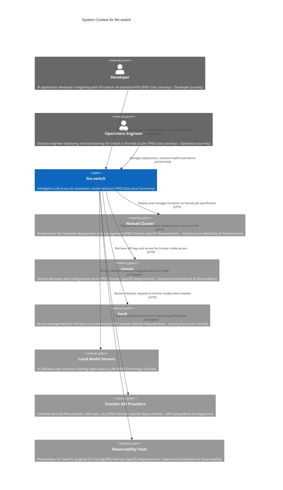

# C1 System Context

## System Context
The llm-switch system is an intelligent LLM proxy designed to automate optimal model selection for AI applications while encouraging privacy-preserving, cost-effective local model usage [PRD-Executive Summary]. It eliminates manual model selection complexity by dynamically choosing the best model per query based on real-time factors such as complexity, latency, and cost [PRD-Success Criteria - User Success]. The system provides unified access through industry-standard OpenAI and Anthropic-compatible APIs, enabling seamless integration with existing AI applications requiring zero code changes [PRD-Domain-Specific Requirements - API Compatibility & Integration]. Built as a lightweight Go service, llm-switch runs in a Docker container orchestrated by Nomad, leveraging Consul for service discovery and Vault for secure secret management [PRD-Technology Choices]. The system monitors local model servers (vLLM/llama.cpp instances) and frontier API providers, making real-time routing decisions to optimize cost efficiency and response times [PRD-Success Criteria - Business Success]. With a target of under 500ms response time for 95% of routine decisions and zero request retries due to model failure, llm-switch delivers immediate usability while progressively improving accuracy through its offline self-learning system [PRD-Success Criteria - Measurable Outcomes].

## User Roles
Two primary user roles interact with llm-switch: Developers and Operations Engineers [PRD-User Journeys]. Developers integrate llm-switch by simply changing their application's endpoint from direct model APIs to llm-switch, benefiting from automatic routing without code modifications [PRD-User Journeys - Developer Journey]. They experience consistent, reliable response times and transparent model selection logic for debugging [PRD-User Experience]. Operations Engineers deploy and maintain llm-switch in the Nomad cluster, managing configuration through Consul and Vault [PRD-User Journeys - Operations Journey]. They rely on health check endpoints and metrics for monitoring, with minimal ongoing intervention due to the system's self-learning capabilities that optimize resource utilization overnight [PRD-Operational Excellence & Observability]. Both roles benefit from reduced operational overhead—developers spend zero time on model selection, while operations teams see approximately 70% reduction in LLM integration maintenance [PRD-User Journeys - Operations Journey].

## External Dependencies
llm-switch depends on six external systems for core functionality [PRD-Domain-Specific Requirements - Infrastructure Reliability & Performance]. Nomad Cluster orchestrates container deployment, ensuring scalable and fault-tolerant operation [PRD-Project Scoping & Phased Development - MVP Strategy]. Consul provides service discovery and distributed configuration, enabling dynamic registration of llm-switch instances and discovery of backend services [PRD-Domain-Specific Requirements - Operational Excellence & Observability]. Vault manages secrets including API keys for frontier models, integrating with the cluster's security infrastructure [PRD-Domain-Specific Requirements - Security & Access Control]. Local Model Servers (vLLM/llama.cpp instances) host open-source LLMs like Qwen and Nemotron, providing cost-effective inference [PRD-Technology Choices]. Frontier API Providers (OpenAI, Anthropic, etc.) offer access to commercial models when local alternatives are insufficient [PRD-Domain-Specific Requirements - API Compatibility & Integration]. Observability Tools (Prometheus for metrics, langfuse for tracing) enable monitoring, alerting, and trace accumulation for self-learning [PRD-Domain-Specific Requirements - Operational Excellence & Observability].

## Key Interactions
Developers interact with llm-switch by sending LLM requests via OpenAI/Anthropic-compatible API endpoints, which the system routes to appropriate models [PRD-Domain-Specific Requirements - API Compatibility & Integration]. Operations Engineers deploy llm-switch using Nomad job specifications, with Consul registering the service and Vault providing secrets [PRD-User Journeys - Operations Journey]. At runtime, llm-switch queries Consul for service discovery, retrieves credentials from Vault, and monitors Nomad for deployment status [PRD-Domain-Specific Requirements - Infrastructure Reliability & Performance]. The system routes requests to Local Model Servers or Frontier API Providers based on real-time complexity assessment, exporting metrics to Prometheus and traces to langfuse [PRD-Innovation & Novel Patterns - Two-Part Autonomous Learning Architecture]. During API timeout scenarios or network partitions, llm-switch implements automatic fallback to more capable models and queues requests for retry [PRD-Non-Functional Requirements - Reliability]. The self-learning system analyzes langfuse traces overnight to refine routing decisions, adjusting thresholds without manual intervention [PRD-Self-Learning & Optimization]. All interactions maintain HTTP-only communication within the cluster network, ensuring security compliance [PRD-Domain-Specific Requirements - Security & Access Control].