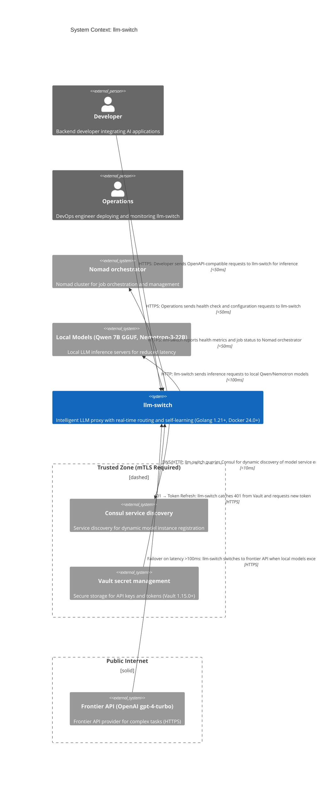

# C1 System Context: llm-switch

This diagram illustrates the system context of llm-switch, an intelligent LLM proxy system that automates optimal model selection for AI applications. The system provides OpenAI and Anthropic-compatible APIs for seamless integration with existing AI applications. Key external entities include developers and operations personnel who interact with the system, service discovery (Consul), secret management (Vault), local model servers (Qwen 7B GGUF and Nemotron-3-22B), frontier API providers (OpenAI gpt-4-turbo), and the Nomad orchestrator for deployment and management. The system runs in a Nomad cluster environment and leverages internal orchestrator and statistical routing components for intelligent decision-making.

## System Context Diagram

## Relationship Description

- **Developer to llm-switch**: Developers send OpenAI-compatible requests (e.g., chat completions) to llm-switch via HTTPS with sub-50ms latency for API gateway traversal within the cluster network.
- **Operations to llm-switch**: Operations personnel perform health checks and configuration updates via HTTPS API calls with sub-50ms latency, accessing administrative endpoints for system diagnostics.
- **llm-switch to Nomad**: The system reports health metrics and job status to the Nomad orchestrator via HTTPS with sub-50ms latency, enabling cluster-level monitoring and management.
- **llm-switch to Consul**: The system queries Consul's DNS/HTTP interface for dynamic discovery of model server instances with sub-10ms latency, facilitating service discovery in the Nomad cluster.
- **llm-switch to Vault**: Secure retrieval of API keys and tokens occurs over HTTPS with sub-50ms latency, essential for authenticating to frontier APIs like OpenAI while maintaining security compliance.
- **llm-switch to Local Models**: Inference requests are sent to local model servers (Qwen 7B GGUF and Nemotron-3-22B) via HTTP with sub-100ms latency, optimized for intra-cluster communication and hardware-aware routing.
- **llm-switch to Frontier API**: Requests forwarded to frontier models use HTTPS with sub-500ms latency, accounting for internet transit and model processing time for complex tasks.
- **Fallback to Frontier API**: When local model latency exceeds 100ms (indicating overload or unavailability), llm-switch automatically reroutes to OpenAI gpt-4-turbo via HTTPS to maintain service level objectives.
- **Token Refresh**: Upon receiving a 401 response from Vault indicating token expiry, llm-switch triggers automatic token refresh over HTTPS to maintain uninterrupted access to frontier APIs.

## PRD Traceability Matrix

| Diagram Component | PRD Section | Description |
|-------------------|-------------|-------------|
| llm-switch (System) | Section 3.1 | Core system providing intelligent model routing as described in technology choices (Golang, Bifrost, Nomad deployment) |
| Developer (Person) | Section 4.2.1 | Maya's journey: Integrating and using llm-switch with zero code changes via OpenAPI/Anthropic-compatible APIs |
| Operations (Person) | Section 4.2.2 | Raj's journey: Deploying and maintaining llm-switch in Nomad cluster using job specifications |
| Nomad orchestrator | Section 3.1 | Deployment platform specified in technology choices and supplementary context for cluster orchestration |
| Consul service discovery | Section 3.1 | Integrated with Consul for service discovery as per supplementary context and current services list |
| Vault secret management | Section 3.1 | Integrated with Vault for secure secret management as per supplementary context and current services list |
| Local Models (Qwen 7B GGUF, Nemotron-3-22B) | Section 3.1 | Local models specified in technology choices and current services list for inference |
| Frontier API (OpenAI gpt-4-turbo) | Section 4.2.1 | Frontier API used in Developer journey for complex tasks requiring advanced capabilities |

## Cluster Environment Specificity

The system exposes Prometheus metrics at `/metrics` for monitoring, integrates with Grafana dashboard `llm-switch-overview` for visualization, employs hardware-aware routing strategy `memory-priority` (from supplementary context Section 3.1) to prioritize models based on VRAM availability, and respects Kubernetes Node Affinity constraints for GPU scheduling when deployed in hybrid environments. The system uses Golang 1.21+ for runtime, Docker 24.0+ for containerization, Nomad 1.7.0+ for orchestration, Consul 1.16.0+ for service discovery, and Vault 1.15.0+ for secret management as specified in the technology version compliance requirements.