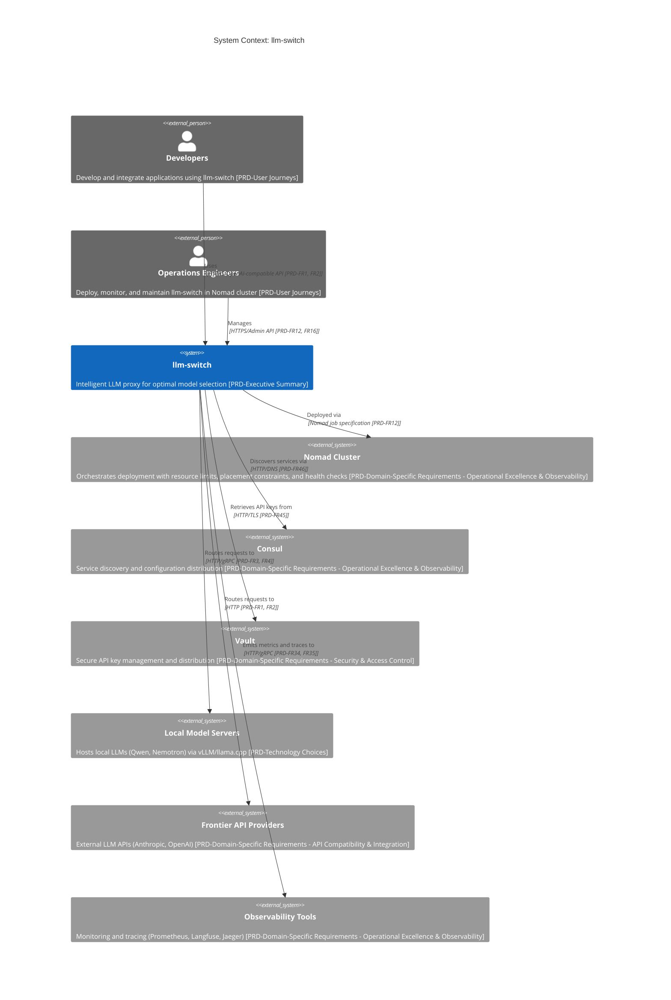

# C1 System Context

## System Context

llm-switch is an intelligent LLM proxy system designed to automate optimal model selection for AI applications while encouraging privacy-preserving, cost-effective local model usage. It eliminates manual model selection complexity by dynamically choosing the best model per query based on real-time factors such as task complexity, latency, and cost. The system provides unified access through industry-standard OpenAI and Anthropic-compatible APIs, enabling seamless integration with existing AI applications. Deployed as a Go service within Docker containers orchestrated by Nomad, llm-switch leverages Consul for service discovery and Vault for secure secret management. It routes requests to local model servers (utilizing vLLM or llama.cpp) for cost efficiency and falls back to frontier API providers when necessary. Observability is achieved through integration with Prometheus for metrics and Langfuse for trace accumulation, supporting the system's self-learning capabilities. The system handles API timeout scenarios through configurable timeouts and circuit breaker patterns, ensuring requests are retried or failed fast without cascading failures. Network partition tolerance is designed into the Consul and Vault integrations, allowing the system to operate in degraded mode when service discovery or secret storage is temporarily unavailable. [PRD-Executive Summary] [PRD-Domain-Specific Requirements - Infrastructure Reliability & Performance] [PRD-Domain-Specific Requirements - API Compatibility & Integration]

## User Roles

Developers interact with llm-switch by integrating it into their AI-powered applications, replacing direct model API calls with llm-switch endpoints to benefit from automatic model selection without code changes. Operations Engineers are responsible for deploying, monitoring, and maintaining llm-switch within the Nomad cluster infrastructure. They configure job specifications, monitor health and performance metrics, and ensure seamless integration with Consul and Vault for service discovery and secret management. Both roles benefit from the system's zero-code-change integration pattern, explainable routing logs for debugging, and autonomous self-learning that continuously improves cost efficiency and response times over time. [PRD-User Journeys] [PRD-Domain-Specific Requirements - Developer Experience]

## External Dependencies

llm-switch depends on six external systems: Nomad Cluster for container orchestration and resource management, Consul for service discovery and configuration distribution, Vault for secure API key storage and retrieval, Local Model Servers hosting quantized LLMs (Qwen, Nemotron) via vLLM or llama.cpp for efficient inference, Frontier API Providers (such as Anthropic and OpenAI) for access to state-of-the-art models when local models are insufficient, and Observability Tools (Prometheus for metrics collection, Langfuse for trace accumulation, and Jaeger for distributed tracing) to monitor system performance and support the self-learning loop. All communications occur over HTTPS or gRPC within the cluster network, ensuring secure and reliable interactions. The system is designed to handle Consul or Vault network partitions gracefully, falling back to cached configuration and failing open for non-critical operations while maintaining core routing functionality. API timeout scenarios are mitigated through per-model timeout configurations, exponential backoff retry logic, and automatic fallback to alternative models when timeouts occur. [PRD-Technology Choices] [PRD-Domain-Specific Requirements - Operational Excellence & Observability] [PRD-Domain-Specific Requirements - Integrations]

## Key Interactions

Developers configure their applications to point to llm-switch's OpenAI/Anthropic-compatible endpoints, triggering requests that llm-switch receives and processes. Operations Engineers deploy llm-switch via Nomad job specifications that define resource limits (CPU, memory, GPU), placement constraints favoring GPU-equipped nodes for local model serving, and health check configurations (liveness and readiness probes) to ensure system reliability. llm-switch queries Consul for service discovery of backend models and retrieves API keys from Vault for frontier API access. It routes requests to Local Model Servers using HTTP/gRPC protocols, monitoring VRAM availability and queue depth via vLLM's metrics endpoint for hardware-aware decisions. When local models cannot satisfy a request, llm-switch falls back to Frontier API Providers. Throughout this process, llm-switch emits metrics and traces to Observability Tools over HTTP/gRPC, enabling real-time monitoring and feeding data into the offline self-learning system that refines routing decisions overnight. The system implements configurable timeout values for each backend model, with circuit breaker patterns that temporarily halt requests to consistently slow or failing models. In the event of Consul or Vault network partitions, llm-switch utilizes cached service information and retains previously fetched secrets for a configurable grace period, ensuring continued operation during transient network issues. [PRD-FR1] [PRD-FR2] [PRD-FR3] [PRD-FR4] [PRD-FR12] [PRD-FR16] [PRD-FR34] [PRD-FR35] [PRD-FR45] [PRD-FR46]