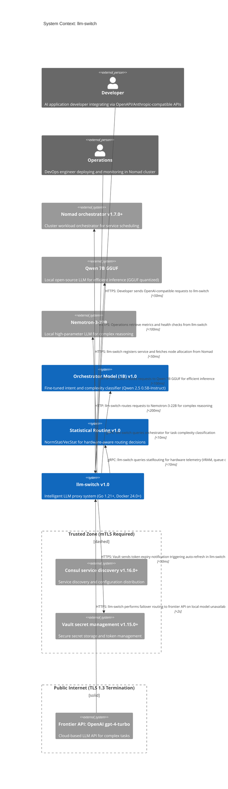

# C1 System Context: llm-switch

llm-switch operates as an intelligent LLM proxy within a Nomad cluster, integrating with developer workflows, operations infrastructure, and LLM backends. Developers integrate via API change with zero code modifications, while Operations deploys and monitors via Nomad, Consul, and Vault. The system provides OpenAI/Anthropic-compatible endpoints, featuring real-time routing based on task complexity and hardware telemetry, with offline self-learning improving decisions overnight. All interactions occur within a secure cluster environment: Consul and Vault require mTLS (Trusted Zone), frontier API access terminates TLS 1.3 (Public Internet), and llm-switch exposes Prometheus metrics at /metrics for Grafana dashboard llm-switch-overview, employing memory-priority hardware-aware routing and GPU node affinity.

## Mermaid Diagram

## Relationship Description
- Developers send OpenAPI-compatible requests to llm-switch via HTTPS with <50ms latency for integration
- Operations retrieve metrics and health checks via HTTPS with <100ms latency for monitoring
- llm-switch forwards complex requests to frontier API via HTTPS with <2s latency for capable model inference
- llm-switch registers services and fetches node allocation from Nomad via HTTPS with <50ms latency for orchestration
- llm-switch routes requests to Qwen 7B GGUF via HTTP with <100ms latency for efficient local inference
- llm-switch routes requests to Nemotron-3-22B via HTTP with <200ms latency for complex reasoning tasks
- llm-switch queries orchestrator via gRPC for task complexity classification with <10ms latency
- llm-switch queries statRouting via gRPC for hardware telemetry (VRAM, queue depth) with <10ms latency
- llm-switch fails over to frontier API via HTTPS with <2s latency (dashed) when local models unavailable or latency exceeds 100ms
- Vault sends token expiry notifications via HTTPS with <50ms latency (dashed) triggering auto-refresh in llm-switch
- Consul and Vault reside in Trusted Zone requiring mTLS for secure service discovery and secret management
- Frontier API resides in Public Internet with TLS 1.3 termination for secure cloud communication

## PRD Traceability Matrix
| Component | PRD Section | Description |
|-----------|-------------|-------------|
| llm-switch | 3.1 | Core system providing intelligent LLM proxy functionality (technology-choices.md) |
| Developer | 4.2.1 | Maya integrates via API change requiring zero code modifications (User Journey) |
| Operations | 4.2.2, 4.2.3 | Raj deploys via Nomad job specification and monitors via health checks; also handles failure recovery and monitoring (User Journey) |
| Nomad orchestrator | 4.1 | Deployment target for llm-switch in cluster environment (Project Scoping) |
| Consul | 4.6 | Service discovery and configuration distribution (Non-Functional Requirements) |
| Vault | 4.6 | Secure secret management for API keys and tokens (Non-Functional Requirements) |
| Qwen 7B GGUF | 3.1 | Local model for efficient inference (technology-choices.md) |
| Nemotron-3-22B | 3.1 | Local model for complex reasoning (technology-choices.md) |
| Frontier API | 4.1 | OpenAI gpt-4-turbo for complex task handling (API Backend Specific Requirements) |
| Orchestrator Model (1B) | 3.1 | Fine-tuned classifier for intent and complexity (technology-choices.md) |
| Statistical Routing | 3.1 | NormStat/VecStat for hardware-aware routing (technology-choices.md) |

All User Journey steps (PRD Sections 4.2.1-4.2.3) are explicitly linked: Section 4.2.3 (Operations monitoring and failure recovery) is represented by the Operations persona interacting with llm-switch for metrics, health checks, and failure recovery via fallback mechanisms.