# C2 Container Overview - llm-switch

The llm-switch system implements a two-part autonomous learning architecture combining real-time intelligent model selection with offline self-learning. The API Gateway in the DMZ receives OpenAI/Anthropic-compatible requests and forwards them via bifrost with mTLS encryption and <500ms timeout to the Orchestrator Service. This performs complexity classification using a 1B parameter model and integrates hardware telemetry. The Model Router handles load balancing, circuit breaking, and fallback logic, directing requests to local model adapters (behind load balancers for Qwen and Nemotron) or the frontier API adapter. Local model adapters communicate with external Qwen (24GB VRAM) and Nemotron (48GB VRAM) model servers. The Frontier API Adapter accesses external frontier models via Vault-managed API keys. Internal service communication uses mTLS via Consul Connect. The system integrates with Nomad for orchestration, Consul for service discovery, and Vault for secret management. Monitoring uses a Prometheus exporter, and trace collection for self-learning uses a Langfuse collector. The Offline Self-Learning Container analyzes traces overnight to refine routing thresholds, updating the Model Router asynchronously. Configuration artifacts (Nomad job specs and Consul config) are separated from application code, enabling horizontal scaling and allowing new models via Nomad job updates without modifying containers. Failure handling includes circuit breaker patterns, <500ms timeouts, and a dead letter queue. Health checks are bidirectionally exchanged with Nomad. Developers benefit from zero-code-change integration via standard API endpoints, while operations engineers observe self-learning reports and model additions through the administrative interface. Word count: 200

```mermaid
C4Container
    System_Boundary(external_systems, "External Systems") {
        Boundary(dmz, "DMZ") {
            Container(api_gateway, "API Gateway#lt;br#gt;Golang, bifrost, Docker#lt;br#gt;2x", "Handles OpenAI/Anthropic-compatible API requests", "dmz")
        }
        Boundary(firewall, "Firewall", "dashed") {
            Boundary(internal_vpc, "Internal VPC", "dashed") {
                Boundary(nomad_config, "Nomad Configuration") {
                    Container(nomad_job, "Nomad Job Definition#lt;br#gt;Nomad, Docker#lt;br#gt;Constraints: GPU required for Frontier, Memory: 32GB for Local, Node pool: llm-switch", "Defines Nomad job specifications and constraints for llm-switch deployment", "nomad_config")
                    Container(consul_config, "Consul Configuration#lt;br#gt;Consul, Docker", "Manages Consul service discovery configuration and key-value store settings", "nomad_config")
                }
                Container(orchestrator_service, "Orchestrator Service#lt;br#gt;Golang, 1B parameter model, bifrost, Telemetry: GPU/CPU metrics, Docker#lt;br#gt;2x", "Performs complexity classification and hardware telemetry integration", "internal_vpc")
                Container(model_router, "Model Router#lt;br#gt;Golang, bifrost, Docker#lt;br#gt;2x", "Routes requests, implements load balancing, circuit breaker, and fallback", "internal_vpc")
                Container(qwen_lb, "Qwen Load Balancer#lt;br#gt;Golang, bifrost, Docker#lt;br#gt;2x", "Load balances requests to Qwen adapters", "internal_vpc")
                Container(qwen_adapter_1, "Qwen Adapter#lt;br#gt;Golang, vLLM/llama.cpp, Telemetry: GPU/CPU metrics, Docker#lt;br#gt;Memory: 32GB, Node pool: llm-switch", "Adapts llm-switch interface to Qwen model server for inference", "internal_vpc")
                Container(qwen_adapter_2, "Qwen Adapter#lt;br#gt;Golang, vLLM/llama.cpp, Telemetry: GPU/CPU metrics, Docker#lt;br#gt;Memory: 32GB, Node pool: llm-switch", "Adapts llm-switch interface to Qwen model server for inference", "internal_vpc")
                Container(nemotron_lb, "Nemotron Load Balancer#lt;br#gt;Golang, bifrost, Docker#lt;br#gt;2x", "Load balances requests to Nemotron adapters", "internal_vpc")
                Container(nemotron_adapter_1, "Nemotron Adapter#lt;br#gt;Golang, vLLM/llama.cpp, Telemetry: GPU/CPU metrics, Docker#lt;br#gt;Memory: 32GB, Node pool: llm-switch", "Adapts llm-switch interface to Nemotron model server for inference", "internal_vpc")
                Container(nemotron_adapter_2, "Nemotron Adapter#lt;br#gt;Golang, vLLM/llama.cpp, Telemetry: GPU/CPU metrics, Docker#lt;br#gt;Memory: 32GB, Node pool: llm-switch", "Adapts llm-switch interface to Nemotron model server for inference", "internal_vpc")
                Container(frontier_adapter, "Frontier API Adapter#lt;br#gt;Golang, Docker#lt;br#gt;Node pool: llm-switch", "Adapts to frontier APIs (OpenAI/Anthropic)", "internal_vpc")
                Container(health_check_service, "Health Check Service#lt;br#gt;Golang, Docker#lt;br#gt;Node pool: llm-switch", "Provides health endpoint for Nomad", "internal_vpc")
                Container(prometheus_exporter, "Prometheus Metrics Exporter#lt;br#gt;Golang, Prometheus PushGateway, Docker#lt;br#gt;Node pool: llm-switch", "Exports metrics for monitoring", "internal_vpc")
                Container(langfuse_trace_collector, "Langfuse Trace Collector#lt;br#gt;Golang, Langfuse API, Docker#lt;br#gt;Node pool: llm-switch", "Collects traces for offline self-learning", "internal_vpc")
                Container(offline_self_learning, "Offline Self-Learning Container#lt;br#gt;Golang, Docker#lt;br#gt;Node pool: llm-switch", "Analyzes traces and refines routing thresholds", "internal_vpc")
                Container(admin_interface, "Administrative Interface#lt;br#gt;Golang, Docker#lt;br#gt;Node pool: llm-switch", "Provides system configuration and diagnostics", "internal_vpc")
                Container(consul_integration, "Consul Integration#lt;br#gt;Golang, Consul API, Docker#lt;br#gt;Node pool: llm-switch", "Integrates with Consul for service discovery", "internal_vpc")
                Container(vault_integration, "Vault Integration#lt;br#gt;Golang, Vault API, Docker#lt;br#gt;Node pool: llm-switch", "Integrates with Vault for secret management", "internal_vpc")
                Container(dead_letter_queue, "Dead Letter Queue#lt;br#gt;Redis, Docker#lt;br#gt;Node pool: llm-switch", "Stores persistently failed requests after 3 retries", "internal_vpc")
            }
        }
        System_Ext(nomad_cluster, "Nomad Cluster#lt;br#gt;3 nodes", "", "external_systems")
        System_Ext(consul, "Consul Service Discovery and KV#lt;br#gt;3 nodes", "", "external_systems")
        System_Ext(vault, "Vault Secret Storage#lt;br#gt;3 nodes", "", "external_systems")
        System_Ext(qwen, "Qwen Model Server#lt;br#gt;VRAM 24GB#lt;br#gt;2x", "", "external_systems")
        System_Ext(nemotron, "Nemotron Model Server#lt;br#gt;VRAM 48GB#lt;br#gt;2x", "", "external_systems")
        System_Ext(frontier, "Frontier API Providers#lt;br#gt;OpenAI, Anthropic#lt;br#gt;1x", "", "external_systems")
        System_Ext(prometheus_backend, "Prometheus Monitoring Backend#lt;br#gt;2x", "", "external_systems")
        System_Ext(langfuse_backend, "Langfuse Backend#lt;br#gt;2x", "", "external_systems")
    }
    Rel(api_gateway, orchestrator_service, "HTTP/1.1", "bifrost, <500ms timeout, mTLS")
    Rel(orchestrator_service, model_router, "Routing Decision (includes VRAM-aware routing)", "gRPC, mTLS")
    Rel(model_router, qwen_lb, "Forward Request", "gRPC, Load Balanced, Circuit Breaker, <500ms timeout, Low Cost")
    Rel(model_router, nemotron_lb, "Forward Request", "gRPC, Load Balanced, Circuit Breaker, <500ms timeout, Low Cost")
    Rel(model_router, frontier_adapter, "Forward Request", "gRPC, Circuit Breaker, <500ms timeout, High Cost")
    Rel(qwen_lb, qwen_adapter_1, "Forward Request", "gRPC")
    Rel(qwen_lb, qwen_adapter_2, "Forward Request", "gRPC")
    Rel(nemotron_lb, nemotron_adapter_1, "Forward Request", "gRPC")
    Rel(nemotron_lb, nemotron_adapter_2, "Forward Request", "gRPC")
    Rel(model_router, langfuse_trace_collector, "Send Traces", "Langfuse API, asynchronous, mTLS", "dashed")
    Rel(langfuse_trace_collector, offline_self_learning, "Provide Traces", "Langfuse API, asynchronous, mTLS", "dashed")
    Rel(offline_self_learning, model_router, "Update Routing Thresholds", "asynchronous, mTLS", "dashed")
    Rel(orchestrator_service, qwen_adapter_1, "Pull Telemetry", "asynchronous, mTLS", "dashed")
    Rel(orchestrator_service, qwen_adapter_2, "Pull Telemetry", "asynchronous, mTLS", "dashed")
    Rel(orchestrator_service, nemotron_adapter_1, "Pull Telemetry", "asynchronous, mTLS", "dashed")
    Rel(orchestrator_service, nemotron_adapter_2, "Pull Telemetry", "asynchronous, mTLS", "dashed")
    Rel(qwen_adapter_1, qwen, "Inference and Telemetry", "gRPC, mTLS")
    Rel(qwen_adapter_2, qwen, "Inference and Telemetry", "gRPC, mTLS")
    Rel(nemotron_adapter_1, nemotron, "Inference and Telemetry", "gRPC, mTLS")
    Rel(nemotron_adapter_2, nemotron, "Inference and Telemetry", "gRPC, mTLS")
    Rel(frontier_adapter, frontier, "Forward Request", "HTTPS")
    Rel(consul_integration, consul, "Service Discovery/KV", "Consul API, mTLS")
    Rel(vault_integration, vault, "Secret Storage", "Vault API, mTLS")
    Rel(prometheus_exporter, prometheus_backend, "Push Metrics", "Prometheus PushGateway, mTLS")
    Rel(langfuse_trace_collector, langfuse_backend, "Send Traces", "Langfuse API, mTLS")
    Rel(admin_interface, nomad_job, "Update Job Spec (add new LLM model)", "Nomad API, mTLS")
    Rel(admin_interface, consul_integration, "Update Config", "Consul API, mTLS")
    Rel(admin_interface, vault_integration, "Update Secrets", "Vault API, mTLS")
    BiRel(health_check_service, nomad_cluster, "Health Check", "Nomad SDK, mTLS")
    Rel(model_router, dead_letter_queue, "After 3 retries", "asynchronous, mTLS", "dashed")
    %% Fallback paths
    Rel(model_router, nemotron_lb, "Fallback Request on Qwen failure", "gRPC, Circuit Breaker, <500ms timeout, Low Cost")
    Rel(model_router, qwen_lb, "Fallback Request on Nemotron failure", "gRPC, Circuit Breaker, <500ms timeout, Low Cost")
    UpdateLayoutConfig($c4ShapeInRow="3", $c4BoundaryInRow="1")
```

