# C2 Container Diagram for llm-switch

The llm-switch system consists of containers working together to provide intelligent LLM model routing. The API Gateway handles incoming OpenAI/Anthropic-compatible requests and forwards them to the Orchestrator Service for complexity classification. The Model Router selects appropriate model instances and load balances across available models. Local and Frontier Model Adapters interface with respective backend services. Administrative Interface provides configuration and runs offline self-learning. Monitoring and Health Check services enable observability. Consul and Vault integrations provide service discovery and secret management. All containers are Docker-based and orchestrated by Nomad.

```mermaid
C4Container
    title C2 Container Diagram for llm-switch
    Container(api_gateway, "API Gateway<br>Golang, bifrost, Docker", "Handles OpenAI/Anthropic-compatible API requests, initial validation, and routing to Orchestrator Service", "2x")
    Container(orchestrator, "Orchestrator Service<br>Golang, 1B parameter model, NormStat/VecStat, Docker", "Classifies request complexity using 1B model and statistical routing; integrates hardware telemetry", "2x")
    Container(model_router, "Model Router<br>Golang, Docker", "Selects model instance based on classification; load balances across models; implements circuit breaker and fallback", "2x")
    Container(local_adapter, "Local Model Adapter<br>Golang, Docker (vLLM/llama.cpp)", "Interfaces with local model instances (Qwen, Nemotron); collects hardware telemetry", "2x")
    Container(frontier_adapter, "Frontier API Adapter<br>Golang, Docker", "Interfaces with frontier model APIs (OpenAI, Anthropic); manages API keys and rate limits", "2x")
    Container(monitoring, "Monitoring Service<br>Golang, Prometheus client, Docker", "Exposes Prometheus metrics endpoint; collects and exports latency, usage, and error metrics", "1x")
    Container(health_check, "Health Check Service<br>Golang, Docker", "Provides health check endpoint for Nomad orchestration; checks liveness/readiness", "2x")
    Container(admin, "Administrative Interface<br>Golang, Docker", "Provides administrative endpoints for configuration; runs offline self-learning system overnight", "1x")
    Container(consul, "Consul Integration<br>Golang, Consul client, Docker", "Service discovery and configuration retrieval from Consul", "2x")
    Container(vault, "Vault Integration<br>Golang, Vault client, Docker", "Secure retrieval of secrets (API keys) from Vault", "2x")
    
    System_Ext(nomad, "Nomad", "Container orchestration platform [FR12]")
    System_Ext(qwen_model, "Qwen Model Server", "Local LLM instance (Qwen 7B/72B) [FR4, FR5]")
    System_Ext(nemotron_model, "Nemotron Model Server", "Local LLM instance (Nemotron 3 22B) [FR4, FR5]")
    System_Ext(frontier_api, "Frontier API Provider", "External LLM API (OpenAI, Anthropic) [FR1, FR2]")
    System_Ext(vllm_metrics, "vLLM/llama.cpp Metrics", "Hardware telemetry endpoint for GPU/VRAM monitoring [FR38]")
    System_Ext(prometheus, "Prometheus", "Metrics storage and querying system [FR34, FR38]")
    System_Ext(langfuse, "Langfuse", "Trace collection and analysis platform [FR10, FR40]")
    System_Ext(consul_ext, "Consul", "Service discovery and key-value store [FR12, FR45]")
    System_Ext(vault_ext, "Vault", "Secret management system [FR44, FR45]")
    
    Rel(api_gateway, orchestrator, "HTTP/1.1 (sync)", "API Request")
    Rel(orchestrator, model_router, "gRPC (sync)", "Complexity Classification")
    Rel(model_router, local_adapter, "HTTP/1.1 (sync)", "Model Request (Local)")
    Rel(model_router, frontier_adapter, "HTTP/1.1 (sync)", "Model Request (Frontier)")
    Rel(local_adapter, qwen_model, "gRPC (sync)", "Qwen Inference")
    Rel(local_adapter, nemotron_model, "gRPC (sync)", "Nemotron Inference")
    Rel(frontier_adapter, frontier_api, "HTTPS (sync)", "Frontier API Request")
    Rel(orchestrator, vllm_metrics, "HTTP/1.1 (async)", "GPU/CPU Metrics")
    Rel(model_router, monitoring, "Prometheus PushGateway (async)", "Metrics")
    BiRel(admin, monitoring, "HTTP/1.1 (async)", "Metrics Read/Write")
    BiRel(admin, consul, "Consul API (async)", "Config Read/Update")
    BiRel(admin, vault, "Vault API (async)", "Secret Read/Update")
    Rel(consul, consul_ext, "Consul API (sync)", "Service Discovery/KV")
    Rel(vault, vault_ext, "Vault API (sync)", "Secret Retrieval")
    Rel(admin, nomad, "Nomad SDK (async)", "Job Deployment/Status")
    Rel(monitoring, prometheus, "HTTP/1.1 (async)", "Metrics Scrape")
    Rel(admin, langfuse, "Langfuse API (async)", "Trace Upload")
    UpdateLayoutConfig($c4ShapeInRow="3", $c4BoundaryInRow="1")
```

### Relationship Description

The API Gateway synchronously receives client requests and forwards them to the Orchestrator Service for complexity classification. The Orchestrator Service asynchronously polls vLLM/llama.cpp metrics for hardware-aware routing decisions. The Model Router synchronously routes requests to either the Local Model Adapter (for Qwen/Nemotron) or Frontier API Adapter based on classification results. The Local Model Adapter synchronously interfaces with Qwen and Nemotron model servers, while the Frontier API Adapter synchronously calls external frontier APIs. 

Asynchronous relationships include: Model Router pushing metrics to the Monitoring Service; Administrative Interface reading/writing configuration from Consul and secrets from Vault; Administrative Interface uploading traces to Langfuse for self-learning analysis; Administrative Interface interacting with Nomad for job deployment/status; Monitoring Service scraping metrics to Prometheus; Consul and Vault integrations synchronously communicating with their external counterparts for service discovery and secret management. 

All internal service mesh communication uses mTLS via Consul Connect for security. The diagram demonstrates horizontal scaling through multiple container instances (2x for most services, 1x for singleton services like Administrative Interface and Monitoring Service). Adding a new LLM model requires only updating Nomad job specifications (via Administrative Interface) without modifying application containers, demonstrating extensibility. Security zones are implied: API Gateway in DMZ (exposed externally), internal containers in trusted VPC with mTLS, and external systems (Nomad, Consul, Vault, model servers) in isolated trust boundaries.
Word count: 248