# C2 Container Diagram

llm-switch implements a two-part architecture: real-time intelligent routing selecting optimal models per query, and offline self-learning refining performance overnight. The system is deployed as a Nomad job in a cluster environment with Consul for service discovery and Vault for secrets management.

*Note: Solid arrows = synchronous communication, Dashed arrows = asynchronous communication*
*Note: API Gateway routes: /v1/chat/completions → Orchestrator, /v1/embeddings → Orchestrator, /health → Health Check, /metrics → Prometheus Exporter*

```mermaid
C4Container
    title llm-switch Container Diagram
    System_Boundary(llm-switch, "llm-switch") {
        Container(apiGateway, "API Gateway\nGolang\nbifrost\nDocker", "Exposes:\n/v1/chat/completions → Orchestrator\n/v1/embeddings → Orchestrator\n/health → Health Check\n/metrics → Prometheus Exporter", "")
        Container(orchestratorService, "Orchestrator Service\nGolang\nbifrost\n1B\nNormStat/VecStat\nTelemetry: GPU/CPU metrics\nDocker", "Real-time model selection\nHardware telemetry\nSub-40ms classification", "")
        Container(localModelAdapter, "Local Model\nAdapter\nGolang\nvLLM\nllama.cpp\nDocker\nMemory: 32GB", "Adapts requests\nto local models\n(Qwen, Nemotron)\nGPU/CPU telemetry", "")
        Container(frontierModelAdapter, "Frontier Model\nAdapter\nGolang\nHTTP Client\nvLLM\nllama.cpp\nDocker", "Adapts requests\nto frontier APIs\n(OpenAI, Anthropic)\nGPU required", "")
        Container(nomadJob, "Nomad Job\nDefinition\nNomad\nSDK\nDocker", "Constraints:\nGPU required\nMemory: 32GB\nNode pool: llm-switch", "")
        Container(consulIntegration, "Consul\nIntegration\nGolang\nConsul API\nDocker", "Service discovery\nConfiguration retrieval\nmTLS via\nConsul Connect", "")
        Container(vaultIntegration, "Vault\nIntegration\nGolang\nVault API\nDocker\nsecrets", "Secrets retrieval\nToken management\nTLS 1.3 encrypted", "")
        Container(prometheusExporter, "Prometheus\nMetrics Exporter\nGolang\nPrometheus Client\nDocker", "Exports metrics\nat /metrics\nRequest latency\nModel usage\nError rates", "")
        Container(langfuseTraceCollector, "Langfuse Trace\nCollector\nGolang\nLangfuse API\nDocker", "Asynchronously pushes\ntraces\nRequest/response pairs\nUser feedback signals", "")
        Container(autoResearchLoopAgent, "AutoResearch Loop\nAgent\nGolang\nbackground agent\nDocker", "Offline self-learning\nAnalyzes traces\novernight\nUpdates routing thresholds", "")
    }
    System_Ext(nomad, "Nomad\nManager/Client\n3 nodes", "Orchestration platform")
    System_Ext(consul, "Consul\nService Mesh", "Service discovery and configuration")
    System_Ext(vault, "Vault\nSecrets Store", "Secrets management")
    System_Ext(prometheus, "Prometheus\nServer", "Metrics storage and querying")
    System_Ext(langfuse, "Langfuse\nBackend", "Trace storage and querying")
    System_Ext(localModels, "Local Model\nServers\nQwen, Nemotron,\nGPU servers", "Local LLM inference")
    System_Ext(frontierAPIs, "Frontier API\nProviders\nOpenAI, Anthropic,\nHTTPS", "Frontier LLM APIs")

    Rel(apiGateway, orchestratorService, "Routes request (Circuit Breaker)", "HTTP/1.1")
    Rel(orchestratorService, localModelAdapter, "Selects local model (primary)", "gRPC")
    Rel(orchestratorService, localModelAdapter, "Fallback to Local Model", "gRPC")
    Rel(orchestratorService, frontierModelAdapter, "Selects frontier model", "gRPC")
    Rel(localModelAdapter, orchestratorService, "Error Response", "HTTP/1.1")
    Rel(frontierModelAdapter, orchestratorService, "Error Response", "HTTP/1.1")
    Rel(orchestratorService, apiGateway, "Returns response", "HTTP/1.1")
    Rel(apiGateway, consulIntegration, "Registers service", "Consul API")
    Rel(consulIntegration, apiGateway, "Returns service info", "Consul API")
    Rel(apiGateway, vaultIntegration, "Retrieves secrets", "Vault API")
    Rel(vaultIntegration, apiGateway, "Returns secrets", "Vault API")
    Rel(apiGateway, prometheusExporter, "Pushes metrics", "Prometheus PushGateway")
    Rel(orchestratorService, langfuseTraceCollector, "Pushes traces", "Langfuse API")
    Rel(autoResearchLoopAgent, langfuseTraceCollector, "Reads traces for analysis", "Langfuse API")
    Rel(autoResearchLoopAgent, consulIntegration, "Updates routing thresholds", "Consul API")
    Rel(consulIntegration, orchestratorService, "Watches for configuration changes", "Consul API")
    Rel(nomadJob, nomad, "Deploys llm-switch job", "Nomad SDK")
    Rel(localModelAdapter, localModels, "Invokes local model", "HTTP/1.1")
    Rel(frontierModelAdapter, frontierAPIs, "Invokes frontier API (HTTPS)", "HTTP/1.1")
    Rel(autoResearchLoopAgent, localModels, "Tests routing hypotheses", "HTTP/1.1")
    UpdateLayoutConfig($c4ShapeInRow="3", $c4BoundaryInRow="1")
```

## Relationship Description

- **API Gateway**: Entry point exposing OpenAI/Anthropic-compatible endpoints (`/v1/chat/completions`, `/v1/embeddings`). Routes requests to the Orchestrator Service with circuit breaker resilience over HTTP/1.1.
- **Orchestrator Service**: Real-time routing engine using a 1B parameter model (Qwen/Llama) via bifrost for sub-40ms complexity classification. Selects between Local and Frontier Model Adapters, with primary selection for local models and fallback to local model when frontier fails.
- **Local Model Adapter**: Integrates with local inference servers (vLLM/llama.cpp) for models like Qwen and Nemotron. Handles requests routed to local models and returns errors when local model fails over HTTP/1.1.
- **Frontier Model Adapter**: Connects to frontier APIs (OpenAI, Anthropic) via HTTP client for models exceeding local capabilities. Returns errors when frontier API fails over HTTPS.
- **Nomad Job Definition**: Encapsulates deployment constraints: GPU requirement for frontier adapters, 32GB memory for local adapters, and node pool affinity. Managed via Nomad SDK.
- **Consul Integration**: Handles service discovery (registering llm-switch) and configuration retrieval (routing thresholds) using Consul API.
- **Vault Integration**: Manages secrets (API keys, tokens) retrieval from Vault using Vault API for secure credential access.
- **Prometheus Metrics Exporter**: Exposes llm-switch metrics (request latency, model usage, error rates) at `/metrics` endpoint for scraping by Prometheus server.
- **Langfuse Trace Collector**: Asynchronously pushes request/response pairs and user feedback to Langfuse backend for trace storage and offline analysis.
- **AutoResearch Loop Agent**: Background process that analyzes Langfuse traces overnight to refine routing decisions, updates Consul configuration, and triggers model retraining.
- **Local Model Servers**: External inference servers (e.g., two RTX 2080s) hosting local models like Qwen and Nemotron.
- **Frontier API Providers**: External services (OpenAPI, Anthropic) accessed via HTTPS for models like GPT-OSS-20B.
- **Nomad Cluster**: Orchestration platform (3-node cluster) deploying the llm-switch job via Nomad SDK.
- **Consul Service Mesh**: Provides service discovery, health checking, and configuration distribution for llm-switch components.
- **Vault Secrets Store**: Centralized secrets management for API keys and tokens used by llm-switch.
- **Prometheus Server**: Metrics storage and querying system scraping llm-switch metrics for alerting and dashboarding.
- **Langfuse Backend**: Trace storage and querying system receiving asynchronous traces from llm-switch for offline analysis.