# C2 Container Overview - llm-switch

**Narrative**: This diagram shows the static structure of the llm-switch system at the container level, detailing the 10 containers that implement the real-time routing and offline self-learning architecture. The system is designed for deployment in a Nomad cluster with integrations to Consul for service discovery, Vault for secrets management, and observability tools like Prometheus and Langfuse. The two-part architecture separates real-time decision-making (Real-time Routing Container) from continuous improvement (Offline Self-Learning Container).

*Note: Solid arrows = synchronous communication (HTTP/1.1, gRPC). Dashed arrows = asynchronous communication (Nomad SDK, Consul API, Vault API, Prometheus PushGateway, Langfuse API).*

```mermaid
C4Container
    title llm-switch Container Architecture

    %% External systems (infrastructure and dependencies)
    System_Ext(nomad, "Nomad Cluster: 3 nodes", "Orchestration platform for container deployment [PRD §4.2]")
    System_Ext(consul, "Consul Service Mesh", "Service discovery and configuration [PRD §4.6]")
    System_Ext(vault, "Vault Secrets Store", "Secure secret management for API keys [PRD §4.6]")
    System_Ext(prometheus, "Prometheus Server", "Metrics collection and alerting [PRD §4.4]")
    System_Ext(langfuse, "Langfuse Backend", "Trace collection for model performance analysis [Tech Choices §4]")
    System_Ext(localModels, "Local Model Servers", "Local LLMs (e.g., Qwen 7B, Nemotron 3 22B) [Tech Choices §1]")
    System_Ext(frontierAPIs, "Frontier API Providers", "External LLM APIs (OpenAI, Anthropic) [PRD §4.1]")

    %% Boundary for the llm-switch system
    System_Boundary(llmSwitchBoundary, "llm-switch System") {
        %% Containers
        Container(apiGateway, "API Gateway:<br>Golang, bifrost<br>Docker", "Golang, bifrost, Docker", "Handles OpenAI/Anthropic API requests, routing, and auth [PRD §4.1]")
        Container(realtimeRouter, "Real-time Routing<br>Container:<br>Golang, bifrost<br>1B parameter model", "Golang, bifrost, 1B parameter model", "Routes requests based on complexity using NormStat/VecStat [Tech Choices §2]")
        Container(localAdapter, "Local Model<br>Adapter:<br>vLLM/llama.cpp<br>Docker", "vLLM/llama.cpp, Docker", "Adapts requests for local models like Qwen, Nemotron [Tech Choices §1]. Integrates hardware telemetry (GPU/CPU metrics) for informed routing.")
        Container(frontierAdapter, "Frontier Model<br>Adapter:<br>HTTP client<br>Docker", "HTTP client, Docker", "Connects to frontier APIs like OpenAI, Anthropic [PRD §4.1]. Monitors hardware telemetry (GPU/CPU metrics) for fallback decisions.")
        Container(nomadJob, "Nomad Job<br>Definition:<br>Nomad SDK<br>Docker", "Nomad SDK, Docker", "Defines Nomad job for deployment and scaling [PRD §4.2]")
        Container(consulIntegration, "Consul<br>Integration:<br>Consul API<br>Docker", "Consul API, Docker", "Registers services and discovers dependencies via Consul [PRD §4.6]")
        Container(vaultIntegration, "Vault<br>Integration:<br>Vault API<br>Docker", "Vault API, Docker", "Retrieves API keys and secrets from Vault [PRD §4.6]")
        Container(prometheusExporter, "Prometheus Metrics<br>Exporter:<br>Prometheus PushGateway<br>Docker", "Prometheus PushGateway, Docker", "Exports llm-switch metrics to Prometheus server [PRD §4.4]")
        Container(langfuseCollector, "Langfuse Trace<br>Collector:<br>Langfuse API<br>Docker", "Langfuse API, Docker", "Sends request/response traces to Langfuse for analysis [Tech Choices §4]")
        Container(offlineLearner, "Offline Self-Learning<br>Container:<br>background<br>agent<br>Docker", "background agent, Docker", "Performs overnight training to improve routing decisions [Tech Choices §5]")
    }

    %% Relationships
    %% API Gateway to internal containers
    Rel(apiGateway, realtimeRouter, "HTTP/1.1", "OpenAI/Anthropic API requests (/v1/*) [PRD §4.1]")
    Rel(apiGateway, prometheusExporter, "HTTP/1.1", "Metrics endpoint (/metrics) [PRD §4.4]")
    Rel(apiGateway, offlineLearner, "HTTP/1.1", "Health check endpoint (/health) [PRD §4.3]")

    %% Real-time routing container interactions
    Rel(realtimeRouter, localAdapter, "gRPC", "Request local model inference [Tech Choices §1]")
    Rel(realtimeRouter, frontierAdapter, "gRPC", "Request frontier model inference [PRD §4.1]")
    Rel(realtimeRouter, apiGateway, "HTTP/1.1", "Error response or fallback [PRD §4.3]")
    Rel(realtimeRouter, localAdapter, "HTTP/1.1", "Fallback to local model on frontier failure [PRD §4.3]")

    %% Infrastructure integrations
    Rel(nomadJob, nomad, "Nomad SDK", "Deploy and manage Nomad job [PRD §4.2]")
    Rel(consulIntegration, consul, "Consul API", "Service registration and discovery [PRD §4.6]")
    Rel(vaultIntegration, vault, "Vault API", "Retrieve secrets for API keys [PRD §4.6]")
    Rel(prometheusExporter, prometheus, "Prometheus PushGateway", "Push metrics for scraping [PRD §4.4]")
    Rel(langfuseCollector, langfuse, "Langfuse API", "Send traces for analysis [Tech Choices §4]")

    %% Model adapter to external model servers
    Rel(localAdapter, localModels, "HTTP/1.1", "Inference requests to local models [Tech Choices §1]")
    Rel(frontierAdapter, frontierAPIs, "HTTP/1.1", "API requests to frontier providers [PRD §4.1] [HTTPS]")

    %% Offline self-learning container interactions
    Rel(offlineLearner, langfuse, "Langfuse API", "Fetch traces for analysis [Tech Choices §5]")
    Rel(offlineLearner, realtimeRouter, "HTTP/1.1", "Update routing parameters [Tech Choices §5]")
    Rel(offlineLearner, nomadJob, "Nomad SDK", "Trigger job reconfiguration [Tech Choices §5]")

    %% Update layout configuration
    UpdateLayoutConfig($c4ShapeInRow="3", $c4BoundaryInRow="1")
```

**Relationships Description**:
- **API Gateway**: Receives OpenAI/Anthropic-compatible API requests and routes them to the Real-time Routing Container. Exposes `/metrics` for Prometheus and `/health` for health checks.
- **Real-time Routing Container**: Makes synchronous gRPC calls to Local/Frontier Model Adapters for inference. Sends error responses or fallback triggers back to API Gateway. Uses HTTP/1.1 for health check endpoint.
- **Local Model Adapter**: Converts requests to format expected by local models (vLLM/llama.cpp) and sends inference requests to Local Model Servers. Receives fallback requests from Real-time Routing Container. Integrates hardware telemetry (GPU/CPU metrics) for informed routing decisions.
- **Frontier Model Adapter**: Converts requests to format expected by frontier APIs (OpenAI/Anthropic) and sends HTTPS requests to Frontier API Providers. Monitors hardware telemetry (GPU/CPU metrics) for fallback decisions.
- **Nomad Job Definition**: Uses Nomad SDK to deploy and manage the llm-switch job in the Nomad cluster.
- **Consul Integration**: Registers llm-switch services with Consul and discovers dependencies (like local models) via Consul API.
- **Vault Integration**: Retrieves API keys and secrets from Vault using Vault API for secure authentication.
- **Prometheus Metrics Exporter**: Exposes llm-switch metrics in Prometheus format and pushes them to Prometheus PushGateway for scraping.
- **Langfuse Trace Collector**: Sends request/response traces and metadata to Langfuse Backend for offline analysis.
- **Offline Self-Learning Container**: Fetches traces from Langfuse, analyzes them to improve routing parameters, updates the Real-time Routing Container via HTTP/1.1, and triggers Nomad job reconfiguration for scaling.
- **Error Handling**: Includes explicit error responses from Model Adapters to Real-time Routing Container and fallback paths to Local Model Adapter.