# C2 Container Overview - llm-switch

```mermaid
C4Container
    title llm-switch C2 Container Diagram
    Person_Ext(Developer, "Developer", "Uses llm-switch via OpenAI/Anthropic-compatible API")
    Person_Ext(Operations, "Operations Engineer", "Manages llm-switch deployment and monitoring")
    Boundary(dmz, "DMZ") {
        Container(api_gateway, "API Gateway", "Golang, bifrost, Docker", "Handles OpenAI/Anthropic API requests [Cost: Medium]")
    }
    Boundary(internal, "Internal Network") {
        Container(realtime_routing, "Real-time Routing Container<br>1B parameter model", "Golang, NormStat/VecStat, Docker", "Classifies request complexity [Latency: <40ms, Cost: Low]")
        Container(model_router, "Model Router", "Golang, Docker, bifrost", "Routes requests, implements circuit breaker, load balancing, fallback [Cost: Low]")
        Container(qwen_adapter, "Qwen Adapter<br>2x", "Golang, vLLM/llama.cpp, Docker", "Interfaces with Qwen model server [VRAM: 24GB, Cost: Low]")
        Container(nemotron_adapter, "Nemotron Adapter<br>2x", "Golang, vLLM/llama.cpp, Docker", "Interfaces with Nemotron model server [VRAM: 48GB, Cost: Low]")
        Container(frontier_adapter, "Frontier API Adapter", "Golang, Docker", "Handles frontier API calls [VRAM: N/A, Cost: High]")
        Container(monitoring, "Monitoring Service", "Golang, Prometheus client, Docker", "Exposes Prometheus metrics")
        Container(health_check, "Health Check Service", "Golang, Docker", "Exposes health endpoints for Nomad")
        Container(admin, "Administrative Interface", "Golang, Docker", "Provides config, diagnostics, updates Nomad job specs")
        Container(self_learning, "Offline Self-Learning Container", "Golang, Docker", "Analyzes traces, updates routing thresholds overnight")
        Container(dead_letter, "Dead Letter Queue", "Golang, bifrost, Docker", "Stores failed requests after 3 retries")
    }
    System_Ext(nomad, "Nomad Cluster", "Orchestrator, 3 nodes")
    System_Ext(consul, "Consul", "Service Discovery, Configuration")
    System_Ext(vault, "Vault", "Secret Management")
    System_Ext(qwen_model, "Qwen Model Server", "vLLM server, serves Qwen 2.5 0.5B-Instruct")
    System_Ext(nemotron_model, "Nemotron Model Server", "vLLM server, serves Nemotron 3 22B")
    System_Ext(frontier_api, "Frontier API Providers", "OpenAI, Anthropic APIs")
    System_Ext(langfuse, "Langfuse", "Observability Platform")
    System_Ext(prometheus, "Prometheus Server", "Monitoring and Alerting")
    Rel(Developer, api_gateway, "API Request", "HTTPS")
    Rel(api_gateway, Developer, "API Response", "HTTPS")
    Rel(Operations, api_gateway, "Admin Request", "HTTPS")
    Rel(api_gateway, Operations, "Admin Response", "HTTPS")
    Rel(api_gateway, realtime_routing, "API Request (classified)", "bifrost (mTLS)")
    Rel(realtime_routing, model_router, "Routing Decision", "bifrost (mTLS)")
    Rel(model_router, qwen_adapter, "Route to Qwen (Circuit Breaker, <500ms timeout)", "bifrost (mTLS)")
    Rel(model_router, nemotron_adapter, "Route to Nemotron (Circuit Breaker, <500ms timeout)", "bifrost (mTLS)")
    Rel(model_router, frontier_adapter, "Route to Frontier (Circuit Breaker, <500ms timeout)", "bifrost (mTLS)")
    Rel(qwen_adapter, qwen_model, "Inference Request", "HTTP/1.1")
    Rel(qwen_model, qwen_adapter, "Inference Response", "HTTP/1.1")
    Rel(nemotron_adapter, nemotron_model, "Inference Request", "HTTP/1.1")
    Rel(nemotron_model, nemotron_adapter, "Inference Response", "HTTP/1.1")
    Rel(frontier_adapter, frontier_api, "Inference Request", "HTTPS")
    Rel(frontier_adapter, frontier_api, "Inference Response", "HTTPS")
    Rel(model_router, monitoring, "Metrics", "Prometheus PushGateway")
    Rel(health_check, nomad, "Health Check Response", "HTTP/1.1")
    Rel(nomad, health_check, "Health Check Request", "HTTP/1.1")
    Rel(health_check, qwen_adapter, "Health Check Request (Qwen)", "HTTP/1.1")
    Rel(qwen_adapter, health_check, "Health Check Response (Qwen)", "HTTP/1.1")
    Rel(health_check, nemotron_adapter, "Health Check Request (Nemotron)", "HTTP/1.1")
    Rel(nemotron_adapter, health_check, "Health Check Response (Nemotron)", "HTTP/1.1")
    Rel(health_check, frontier_adapter, "Health Check Request (Frontier)", "HTTP/1.1")
    Rel(frontier_adapter, health_check, "Health Check Response (Frontier)", "HTTP/1.1")
    Rel(qwen_adapter, model_router, "Telemetry: VRAM, Queue Depth", "bifrost (mTLS)")
    Rel(nemotron_adapter, model_router, "Telemetry: VRAM, Queue Depth", "bifrost (mTLS)")
    Rel(frontier_adapter, model_router, "Telemetry: API Latency, Error Rate", "bifrost (mTLS)")
    Rel(model_router, dead_letter, "Failed Request (after 3 retries)", "bifrost (mTLS)")
    Rel(model_router, self_learning, "Traces (request/response pairs)", "bifrost (mTLS)")
    Rel(self_learning, langfuse, "Processed Traces", "HTTPS")
    Rel(admin, nomad, "Update Job Spec (no code change)", "Nomad SDK")
    Rel(nomad, admin, "Job Spec Confirmation", "Nomad SDK")
    Rel(admin, consul, "Update Config", "Consul API")
    Rel(consul, admin, "Config Watch", "Consul API")
    Rel(admin, vault, "Retrieve Secret", "Vault API")
    Rel(vault, admin, "Secret Value", "Vault API")
    Rel(monitoring, prometheus, "Metrics Push", "Prometheus PushGateway")
    UpdateLayoutConfig($c4ShapeInRow="3", $c4BoundaryInRow="1")
```

## Narrative

This C2 container diagram illustrates the llm-switch architecture designed for intelligent LLM model routing in a Nomad cluster. The system consists of an API Gateway in the DMZ handling OpenAI/Anthropic-compatible requests, which forwards classified requests to the Real-time Routing Container for complexity classification using a 1B parameter model and NormStat/VecStat techniques. The Model Router then routes requests to appropriate model adapters (Qwen, Nemotron, or Frontier API) with circuit breaker protection, load balancing, and fallback mechanisms. Each adapter interfaces with its respective model server while collecting hardware telemetry (VRAM, queue depth) for routing decisions. Internal services include Monitoring (Prometheus metrics), Health Check (for Nomad), Administrative Interface (for configuration and Nomad job updates), Offline Self-Learning Container (analyzing traces to improve routing), and Dead Letter Queue for failed requests. Security is enforced via mTLS for internal service communication, with Consul for service discovery and Vault for secret management. Horizontal scaling is shown via 2x notation on adapter containers, indicating multiple instances behind the Model Router's load balancing. Adding new LLM models requires only a Nomad job specification update (no code changes), demonstrated by the Administrative Interface updating Nomad. The diagram explicitly shows failure handling paths (circuit breakers, timeouts, dead letter queue), security zones (DMZ/internal), VRAM-aware routing tiers, and self-learning trace flow from Model Router to Offline Self-Learning Container to Langfuse. Word count: 248