# C2 Container Overview - llm-switch

This diagram shows the container-level architecture of the llm-switch system, illustrating how the real-time routing and offline self-learning components interact with infrastructure dependencies in the Nomad cluster environment.

> **Legend**: Solid arrows = Synchronous communication, Dashed arrows = Asynchronous communication

```mermaid
C4Container
    title C2 Container Overview - llm-switch
    %% Legend: Solid arrows = Synchronous communication, Dashed arrows = Asynchronous communication
    System_Boundary(llm_switch, "llm-switch") {
        Container_Boundary(api_boundary, "API Boundary") {
            Container(apigw, "API Gateway:<br>Golang bifrost<br>Docker<br>Node pool:<br>llm-switch", "Golang, bifrost, Docker", "Handles incoming API requests, routes to orchestrator [FR1, FR2]")
        }
        Container_Boundary(routing_boundary, "Real-time Routing Boundary") {
            Container(orchestrator, "Real-time Routing:<br>Container<br>Golang bifrost<br>1B parameter:<br>model<br>Docker NormStat:<br>VecStat<br>Node pool:<br>llm-switch", "Golang, bifrost, 1B parameter model, Docker, NormStat/VecStat", "Performs real-time model selection based on complexity [FR3]")
        }
        Container_Boundary(adapter_boundary, "Model Adapter Boundary") {
            Container(local_adapter, "Local Model:<br>Adapter<br>vLLM llama.cpp<br>Docker<br>Telemetry:<br>GPU/CPU metrics<br>Memory: 32GB<br>Node pool:<br>llm-switch", "vLLM/llama.cpp, Docker", "Adapts requests for local models (Qwen, Nemotron) [FR4]")
            Container(frontier_adapter, "Frontier Model:<br>Adapter<br>vLLM/llama.cpp<br>HTTP client<br>Docker<br>Telemetry:<br>GPU/CPU metrics<br>GPU required:<br>Node pool:<br>llm-switch", "HTTP client, Docker", "Adapts requests for frontier APIs (OpenAI, Anthropic) [FR5]")
        }
        Container_Boundary(infra_boundary, "Infrastructure Boundary") {
            Container(nomad_job, "Nomad Job:<br>Definition<br>Nomad Job<br>Nomad SDK<br>Docker<br>Node pool:<br>llm-switch", "Nomad SDK, Docker", "Defines Nomad job for llm-switch deployment [FR12]")
            Container(consul_int, "Consul Integration:<br>Consul API<br>Docker<br>Node pool:<br>llm-switch", "Consul API, Docker", "Integrates with Consul for service discovery [FR46]")
            Container(vault_int, "Vault Integration:<br>Vault API<br>secrets<br>Docker<br>Node pool:<br>llm-switch", "Vault API, Docker", "Integrates with Vault for secret management [FR45] [secrets]")
            Container(prometheus_exporter, "Prometheus Metrics:<br>Exporter<br>Prometheus PushGateway<br>Docker<br>Node pool:<br>llm-switch", "Prometheus PushGateway, Docker", "Exports metrics for monitoring [FR34]")
            Container(langfuse_collector, "Langfuse Trace:<br>Collector<br>Langfuse API<br>Docker<br>Node pool:<br>llm-switch", "Langfuse API, Docker", "Collects traces for observability [FR38]")
        }
        Container_Boundary(learning_boundary, "Offline Learning Boundary") {
            Container(autoresearch_loop, "Offline Self-Learning:<br>Container<br>background agent<br>Docker<br>Node pool:<br>llm-switch", "background agent, Docker", "Performs offline analysis and model refinement [FR7-FR11]")
        }
    }
    System_Ext(api_consumer, "API Consumer", "External API consumer (developer or operations)")
    System_Ext(nomad, "Nomad Cluster: 3 nodes", "Manages job scheduling and execution [FR12]")
    System_Ext(consul, "Consul Service Mesh", "Provides service discovery and configuration [FR46]")
    System_Ext(vault, "Vault Secrets Store", "Securely stores and manages API keys [FR45]")
    System_Ext(prometheus, "Prometheus Server", "Collects and stores metrics for alerting [FR34]")
    System_Ext(langfuse, "Langfuse Backend", "Stores traces for analysis and debugging [FR38]")

    %% API Gateway to Orchestrator relationships with specific endpoints and Circuit Breaker
    Rel(apigw, orchestrator, "/v1/chat/completions (Circuit Breaker)", "HTTP/1.1, mTLS via Consul Connect")
    Rel(apigw, orchestrator, "/v1/embeddings (Circuit Breaker)", "HTTP/1.1, mTLS via Consul Connect")

    %% External API consumer to API Gateway (HTTPS)
    Rel(api_consumer, apigw, "API Requests/Responses", "HTTPS")

    %% Orchestrator to Model Adapters (internal service mesh with mTLS)
    Rel(orchestrator, local_adapter, "Model selection: Local (mTLS via Consul Connect)", "gRPC")
    Rel(orchestrator, frontier_adapter, "Model selection: Frontier (mTLS via Consul Connect)", "gRPC")

    %% Error handling and fallback paths
    Rel(local_adapter, orchestrator, "Error Response (mTLS via Consul Connect)", "HTTP/1.1")
    Rel(frontier_adapter, orchestrator, "Error Response (mTLS via Consul Connect)", "HTTP/1.1")
    Rel(orchestrator, local_adapter, "Fallback to Local Model (mTLS via Consul Connect)", "HTTP/1.1")

    %% Infrastructure integrations
    Rel(nomad_job, nomad, "Nomad SDK", "Job deployment")
    Rel(consul_int, consul, "Consul API", "Service discovery")
    Rel(vault_int, vault, "Vault API", "Secrets retrieval")
    Rel(prometheus_exporter, prometheus, "Prometheus PushGateway", "Metrics export")
    Rel(langfuse_collector, langfuse, "Langfuse API", "Trace upload")

    %% Monitoring and health checks
    Rel(apigw, prometheus_exporter, "/metrics (mTLS via Consul Connect)", "HTTP/1.1")
    Rel(apigw, orchestrator, "/health (mTLS via Consul Connect)", "HTTP/1.1")

    %% Offline learning trigger
    Rel(orchestrator, autoresearch_loop, "Background task: Trigger offline learning (mTLS via Consul Connect)", "HTTP/1.1")

    UpdateLayoutConfig($c4ShapeInRow="3", $c4BoundaryInRow="1")
```

### Relationship Description

- **API Gateway to Orchestrator Service**:
  - Two distinct relationships for OpenAI-compatible endpoints (`/v1/chat/completions` and `/v1/embeddings`)
  - Each labeled with "(Circuit Breaker)" to indicate the resilience pattern
  - Protocol: HTTP/1.1 with mTLS via Consul Connect for internal service mesh security

- **External API Consumer to API Gateway**:
  - HTTPS relationship representing external API requests and responses
  - Protocol: HTTPS for secure external communication

- **Orchestrator Service to Model Adapters**:
  - Local Model Adapter: Receives model selection decisions for local models (Qwen, Nemotron)
  - Frontier Model Adapter: Receives model selection decisions for frontier APIs
  - Protocol: gRPC with mTLS via Consul Connect for secure internal communication
  - Labels include both functional purpose and security annotation

- **Error Handling and Fallback**:
  - Model adapters return error responses to Orchestrator Service on failure
  - Orchestrator Service can fallback to Local Model Adapter when frontier model selection fails
  - All error/fallback paths use HTTP/1.1 with mTLS via Consul Connect
  - Labels include security annotation

- **Infrastructure Integrations**:
  - Nomad Job Definition: Deploys llm-switch as a Nomad job (node pool llm-switch)
  - Consul Integration: Service discovery via Consul API
  - Vault Integration: Secret management via Vault API (explicitly labeled with "secrets" in the container label)
  - Prometheus Exporter: Exposes metrics via Prometheus PushGateway
  - Langfuse Collector: Uploads traces via Langfuse API

- **Monitoring and Health Checks**:
  - API Gateway exposes `/metrics` endpoint for Prometheus scraping with mTLS via Consul Connect
  - API Gateway provides `/health` endpoint for cluster orchestration health checks with mTLS via Consul Connect

- **Offline Learning Trigger**:
  - Orchestrator Service triggers background agent in Offline Self-Learning Container for nightly self-learning
  - Uses HTTP/1.1 with mTLS via Consul Connect for secure internal communication
  - Label includes security annotation

All internal service mesh connections are annotated with "mTLS via Consul Connect" in the relationship labels to satisfy security requirements. The diagram explicitly shows the 10 required containers with correct technology stack labeling, adheres to C4 container diagram standards (max 2 words per line in labels via HTML   breaks), and includes all mandatory infrastructure components from the technology choices.