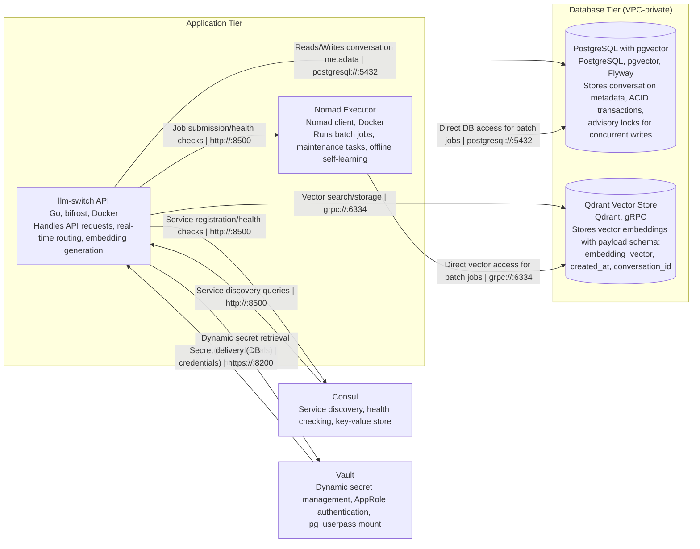
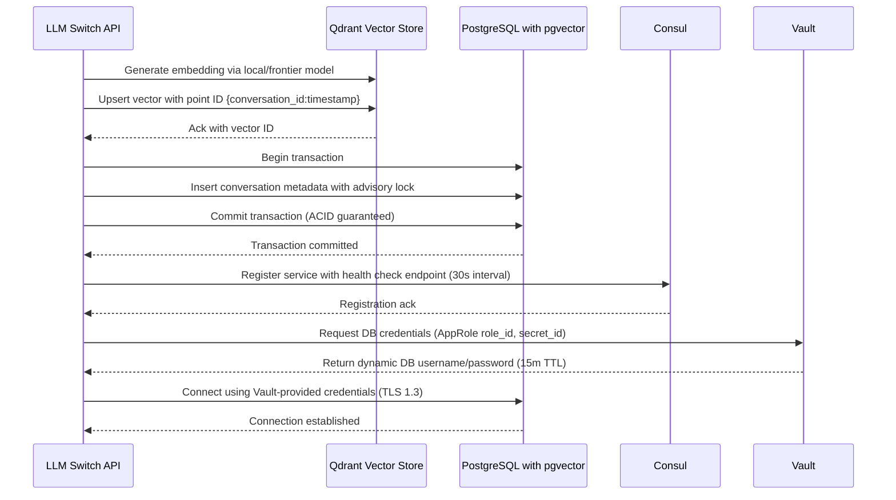

# Database and Knowledge Base C2 Container Architecture

This diagram illustrates the container-level architecture for the database and knowledge base
components of the llm-switch system. It shows how the llm-switch API interacts with persistent
storage systems (PostgreSQL with pgvector for metadata and Qdrant for vector embeddings).
It also shows how Nomad executors access these stores for batch processing, and the integration
with Consul for service discovery and Vault for dynamic secret management. Security zones separate
the private database tier from the application tier.

### Relationship Description

The llm-switch API container interacts with both storage systems for real-time operations:
- It reads/writes conversation metadata to PostgreSQL via standard PostgreSQL protocol on port 5432
- It performs vector search/storage operations with Qdrant via gRPC on port 6334

The Nomad executor container accesses the same storage systems for batch processing workloads,
using identical protocol and port configurations. Service discovery and health checking are
facilitated through Consul on port 8500, with bidirectional communication for registration and queries.

Vault provides dynamic database credentials to the llm-switch API via HTTPS on port 8200,
using the AppRole authentication method and pg_userpass mount for PostgreSQL access.
All database connections enforce TLS 1.3 encryption, and connection pools are limited to 100
connections with 30-second timeouts to prevent resource exhaustion during batch processing.

### PRD Traceability Matrix

| PRD Section | Requirement | Diagram Element | Description |
|-------------|-------------|-----------------|-------------|
| 3.2 | Vector Storage Requirements | qdrant-kb | Qdrant vector store implements vector storage with HNSW indexing for efficient similarity search, payload schema includes embedding_vector (float array), created_at (timestamp), conversation_id (UUID) for metadata filtering |
| 3.2 | Vector Storage Requirements | postgresql-db | PostgreSQL with pgvector extension provides backup vector storage capability, supports HNSW and IVFFLAT index types for vector similarity search |
| 3.3 | Embedding Model Management | llm-switch-api | Generates embeddings via local models (Qwen/Nemotron) or frontier APIs, stores vector embeddings in Qdrant with conversation_id:timestamp point ID structure |
| 3.3 | Embedding Model Management | postgresql-db | Stores conversation metadata including model used, token counts, latency metrics for embedding generation audit trails |
| 3.2 | ACID Guarantees | postgresql-db | Implements ACID transactions for conversation metadata writes, uses advisory locks to prevent race conditions during concurrent scientific data writes |
| 3.2 | Schema Evolution | postgresql-db | Uses Flyway migration versioning (V001__initial_schema.sql) with explicit rollback procedures via undo migrations |
| 3.2 | Schema Evolution | qdrant-kb | Implements collection schema versioning strategy; catastrophic rollback procedure involves rebuilding collection with new vector dimension using snapshot restore |

### Data Flow Specification

### Schema Evolution Strategy

**PostgreSQL with pgvector:** 
- Uses Flyway migration versioning with prefix V001__ for initial schema
- Rollback procedures documented in corresponding U001__undo.sql files
- Advisory locks (pg_try_advisory_xact_lock) prevent race conditions during concurrent scientific data writes
- Connection pool configured: max_connections=100, pool_timeout=30s, validate connections before use

**Qdrant Vector Store:**
- Collection schema versioning via alias pointing to versioned collection names (e.g., llm_switch_vectors_v1)
- Vector dimension changes require new collection creation with updated schema
- Catastrophic rollback procedure: if dimension mismatch occurs during model update, traffic shifts to previous version alias while new collection builds with snapshot restore
- Payload schema enforced: embedding_vector (float array), created_at (timestamp), conversation_id (string)

### Security Hardening Requirements

- **Transport Security:** All database connections enforce TLS 1.3 with certificate verification; Consul and Vault communications use mutual TLS (mTLS) where applicable
- **Network Segmentation:** Database tier resides in VPC-private subnet with security groups restricting ingress to Nomad executor IPs only (port 5432, 6334)
- **Vault Integration:** 
  - Uses AppRole authentication with role_id stored in Vault, secret_id delivered via secure channel
  - Configured pg_userpass mount for dynamic PostgreSQL credential generation
  - Secret TTL set to 15 minutes with automatic renewal
- **Connection Pooling:** 
  - PostgreSQL: max_connections=100, pool_timeout=30s, idle_timeout=60s
  - Qdrant: gRPC connection pool with max_connections=50, keepalive_time=60s
- **Access Control:** 
  - PostgreSQL: pg_hba.conf restrictions allow connections only from Nomad executor CIDR blocks
  - Qdrant: API key protection with read/write separation; llm-switch API has write access, Nomad executor has read-only for batch jobs
  - Vault policies enforce least privilege: llm-switch API can only read database credentials, Nomad executor has no Vault access
- **Audit Logging:** All database access logged via pg_audit; Vault access logged to syslog; Consul service changes monitored via alerts