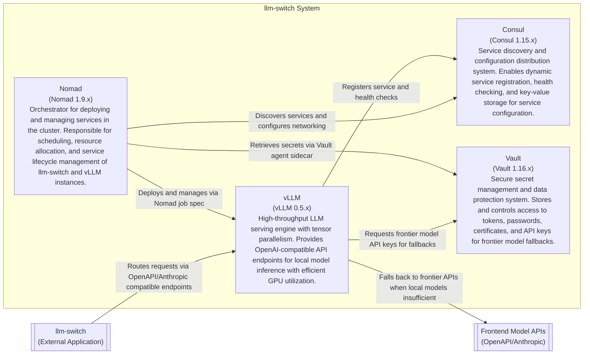

# ADR-001: vLLM Deployment Architecture

**Status:** Proposed  
**Date:** 2026-04-15  
**Author:** Gerald

## Context

We need to deploy vLLM instances for local LLM model serving within the Nomad cluster. The deployment must integrate with Consul for service discovery and Vault for secret management, while providing OpenAI-compatible API endpoints for the llm-switch system. This addresses PRD-FR-12 (Deploy llm-switch in Nomad cluster), PRD-FR-45 (Integration with Consul for service discovery), and PRD-FR-46 (Integration with Vault for secret management).

## Decision Drivers

- **Performance**: vLLM provides high-throughput LLM serving with tensor parallelism and optimized memory management
- **Integration**: Must work with existing Consul and Vault infrastructure in the cluster
- **Operational Simplicity**: Deployment should be straightforward with minimal configuration overhead
- **Resource Efficiency**: Nomad enables efficient resource allocation and isolation for GPU workloads
- **Security**: Secrets (API keys, model access tokens) must be managed securely via Vault

## Decision

We will deploy vLLM as Nomad jobs with Consul service registration and Vault templating for secrets. Each vLLM instance will:
- Run as a Nomad task group with GPU allocation
- Register itself with Consul upon startup using the Consul Nomad plugin
- Retrieve secrets (API keys for frontier model fallbacks) from Vault via agent sidecar
- Expose OpenAI-compatible API endpoints on port 8000
- Include health checks for Nomad and Consul monitoring
- Use the official vLLM Docker image with version pinning

## Consequences

- **Positive**: Enables efficient local model utilization reducing frontier API costs; integrates seamlessly with existing cluster infrastructure; provides automated scaling and failover through Nomad
- **Negative**: Requires GPU allocation planning; adds complexity to Nomad job definitions; introduces dependency on Consul and Vault availability
- **Neutral**: Standardizes deployment pattern for other LLM serving backends; establishes baseline for monitoring and alerting

## Architecture Diagram

---
title: C2 Container Diagram for vLLM Deployment Architecture
---
