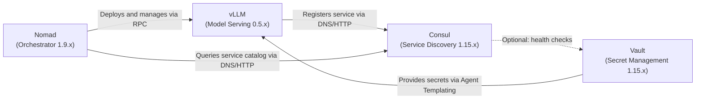

# ADR-001: vLLM Deployment Architecture

**Status**: Accepted  
**Date**: 2026-04-15  
**Author**: Gerald

## Context
We are deploying the llm-switch system in a Nomad cluster environment. The system requires serving large language models (LLMs) for inference, with a preference for local models (e.g., Qwen, Nemotron) to reduce costs and latency. Frontier models (via APIs) are used as fallback. The deployment must integrate with existing cluster services: Consul for service discovery and Vault for secret management (API keys, credentials). The llm-switch proxy (to be developed) will route requests to appropriate model backends.

## Decision Drivers
- PRD-FR-12: Deploy llm-switch in Nomad cluster using simple job specification
- PRD-FR-45: Integrate with Vault for secure API key management and distribution
- PRD-FR-46: Integrate with Consul for service discovery and configuration distribution
- Technology choice: vLLM for high-throughput LLM serving (from technology-choices.md)
- Need for dynamic scaling and fault tolerance in Nomad
- Requirement for secure handling of sensitive data (API keys)

## Decision
Use Nomad to orchestrate vLLM containers as the primary model serving layer. Consul provides service discovery for vLLM instances, enabling the llm-switch proxy to discover backends dynamically. Vault manages secrets (API keys for frontier models, internal tokens) via its agent sidecar pattern, injecting secrets into Nomad job allocations at runtime. The llm-switch proxy registers with Consul as a service, allowing model backends to discover it for callbacks if needed. All inter-service communication occurs over the cluster's HTTP-only network.

## Consequences
- **Positive**: Decoupled service discovery enables flexible scaling; secure secret management reduces leakage risks; Nomad provides built-in health checks and failure detection.
- **Negative**: Increased operational complexity in managing Nomad job schemas and Consul/Vault configurations; potential latency from service discovery lookups.
- **Negative**: Dependency on Consul and Vault availability; misconfiguration can cause service disruption.
- **Neutral**: Requires operational team familiarity with Nomad, Consul, and Vault; aligns with existing cluster infrastructure patterns.

## C4 Container Diagram
---
title: C4 Container Diagram for vLLM Deployment Architecture
---
