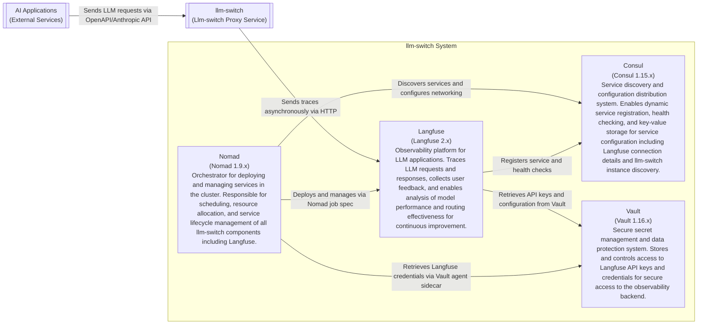

# ADR-002: Langfuse Observability Integration

**Status:** Proposed  
**Date:** 2026-04-15  
**Author:** Gerald

## Context

We need to integrate Langfuse for observability and trace accumulation in the llm-switch system to support the self-learning and optimization features. This integration must work within the existing Nomad/Consul/Vault infrastructure while providing trace data for improving routing decisions. This addresses PRD-FR-34 through PRD-FR-41 regarding observability, metrics, and analytics requirements, particularly the self-learning system described in the technology choices.

## Decision Drivers

- PRD-FR-34: Provide Prometheus-compatible metrics endpoint for monitoring and alerting
- PRD-FR-35: Provide health check endpoint for cluster orchestration systems
- PRD-FR-36: Provide administrative endpoints for system configuration and diagnostics
- PRD-FR-37: Track and analyze request volume and latency per API key
- PRD-FR-38: Monitor and report computational efficiency metrics (local vs frontier model usage)
- PRD-FR-39: Enable A/B testing of routing strategies through configuration
- PRD-FR-40: Share learned optimization patterns across teams and systems
- PRD-FR-41: Monitor request distribution across models to ensure effective load balancing
- Technology choice: Langfuse for trace accumulation (see [technology-choices.md](./technology-choices.md))
- Need for distributed tracing and request/response pair collection
- Requirement for asynchronous telemetry to avoid impacting request latency
- Integration with existing Nomad, Consul, and Vault infrastructure

## Decision

We will integrate Langfuse as an observability backend that runs alongside the llm-switch system in the Nomad cluster. Langfuse will:
- Run as a Nomad job with Consul service registration
- Receive trace data asynchronously from llm-switch instances via HTTP
- Store API keys and credentials securely using Vault agent templating
- Provide trace data for the AutoResearch loop to analyze routing failures
- Enable correlation of traces with llm-switch internal logs via trace IDs
- Support attaching user feedback signals to traces for supervised learning
- Operate asynchronously to avoid impacting request latency in llm-switch

## Consequences

- **Positive**: Enables detailed observability of LLM requests and responses; supports data-driven improvement of routing decisions; facilitates A/B testing and experimentation; provides foundation for AutoResearch loop
- **Negative**: Adds dependency on external service; requires network connectivity to Langfuse instance; increases resource consumption in the cluster
- **Neutral**: Establishes pattern for integrating other observability tools; creates baseline for telemetry data collection that can be extended to other systems

## Architecture Diagram

---
title: C2 Container Diagram for Langfuse Observability Integration
---
