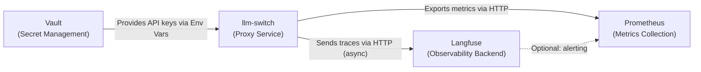

# ADR-002: Langfuse Observability Integration

**Status**: Accepted  
**Date**: 2026-04-15  
**Author**: Gerald

## Context
The llm-switch system requires comprehensive observability to monitor routing decisions, model performance, and system health. Langfuse is chosen for its ability to trace LLM interactions, capture user feedback, and provide analytics for improving model selection. The system must push trace data asynchronously to avoid impacting request latency, and support A/B testing of routing strategies.

## Decision Drivers
- PRD-FR-34: Provide Prometheus-compatible metrics endpoint for monitoring and alerting
- PRD-FR-35: Provide health check endpoint for cluster orchestration systems
- PRD-FR-36: Provide administrative endpoints for system configuration and diagnostics
- PRD-FR-37: Track and analyze request volume and latency per API key
- PRD-FR-38: Monitor and report computational efficiency metrics (local vs frontier model usage)
- PRD-FR-39: Enable A/B testing of routing strategies through configuration
- PRD-FR-40: Share learned optimization patterns across teams and systems
- PRD-FR-41: Monitor request distribution across models to ensure effective load balancing
- Technology choice: Langfuse for trace accumulation (from technology-choices.md)

## Decision
Integrate Langfuse as an asynchronous observability backend. The llm-switch proxy will instrument all incoming requests and outgoing model calls, capturing prompts, responses, latency, and routing decisions. Trace data is batch-sent to Langfuse via HTTP in the background to avoid blocking the request path. Langfuse stores traces enabling:
- Debugging individual requests via trace ID
- Analyzing routing decision effectiveness over time
- A/B testing of routing strategies by tagging traces with experiment identifiers
- Building persistent user/task profiles to identify model strengths
Langfuse credentials are managed by Vault and injected into the llm-switch environment at runtime.

## Consequences
- **Positive**: Rich trace data enables continuous improvement; asynchronous sending maintains low latency; supports experimentation and profiling.
- **Negative**: Added complexity in instrumenting code and managing background workers; dependency on Langfuse availability and network.
- **Negative**: Potential cost for Langfuse usage at scale; requires careful sampling to control volume.
- **Neutral**: Requires team familiarity with OpenTelemetry-like tracing concepts; aligns with existing cluster observability stack (Jaeger, Prometheus).

## C4 Container Diagram
---
title: C4 Container Diagram for Langfuse Observability Integration
---
