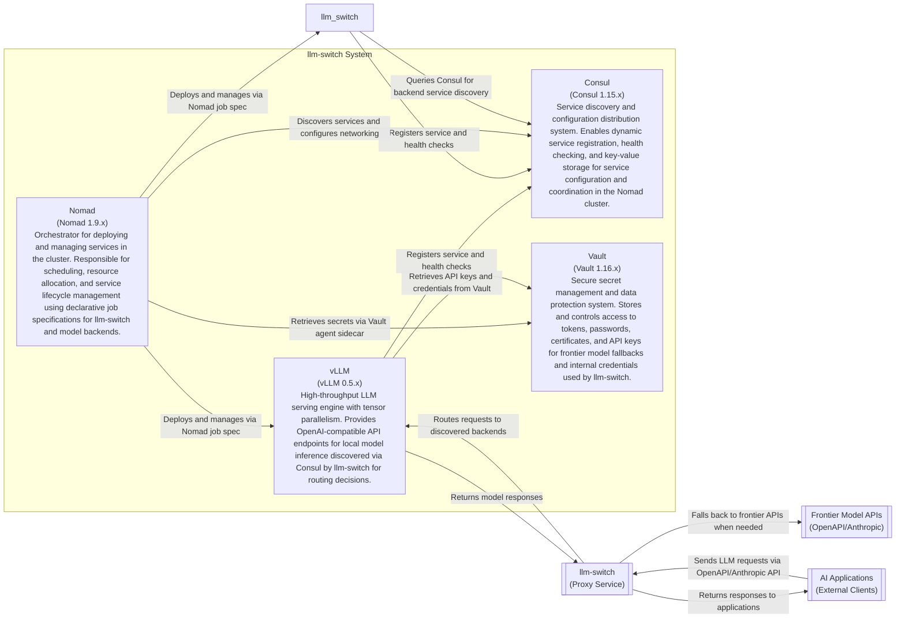

# ADR-003: Consul and Vault Service Discovery

**Status:** Proposed  
**Date:** 2026-04-15  
**Author:** Gerald

## Context

We need to integrate Consul for service discovery and Vault for secret management in the llm-switch system. This integration must enable dynamic discovery of services (llm-switch instances, vLLM backends) and secure retrieval of secrets (API keys, credentials) while maintaining compatibility with the Nomad cluster environment. This addresses PRD-FR-12 (Nomad deployment), PRD-FR-45 (Vault integration), and PRD-FR-46 (Consul integration).

## Decision Drivers

- PRD-FR-12: Deploy llm-switch in Nomad cluster using simple job specification
- PRD-FR-45: Integrate with Vault for secure API key management and distribution
- PRD-FR-46: Integrate with Consul for service discovery and configuration distribution
- Technology choice: Consul and Vault for service discovery and secret management (see [technology-choices.md](./technology-choices.md))
- Need for dynamic service discovery in a dynamic Nomad environment
- Requirement for secure handling of sensitive configuration data

## Decision

We will use Consul as the primary service discovery mechanism and Vault for secret management, both integrated through Nomad's native plugins. The implementation will:
- Use Nomad's Consul plugin for automatic service registration and health checking
- Use Nomad's Vault plugin for secure secret injection into task environments
- Enable llm-switch instances to discover vLLM backends via Consul service queries
- Allow services to retrieve configuration from Consul KV store
- Store frontier model API keys and other secrets in Vault with tight access controls
- Utilize Consul Connect for service-to-service encryption where required
- Maintain loose coupling - services can operate with cached data if Consul/Vault are temporarily unavailable

## Consequences

- **Positive**: Enables dynamic scaling and service discovery; provides secure secret management; reduces configuration drift; integrates naturally with Nomad workflows
- **Negative**: Adds dependency on Consul and Vault availability; increases complexity of Nomad job definitions; requires operational expertise in Consul/Vault
- **Neutral**: Establishes standardized service discovery pattern for other cluster services; creates foundation for advanced features like Consul Connect

## Architecture Diagram

---
title: C2 Container Diagram for Consul and Vault Service Discovery
---
