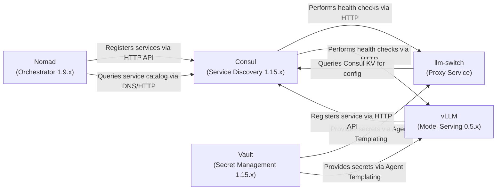

# ADR-003: Consul and Vault Service Discovery

**Status**: Accepted  
**Date**: 2026-04-15  
**Author**: Gerald

## Context
The llm-switch system operates in a Nomad cluster environment that already provides Consul for service discovery and Vault for secret management. Services need to discover each other dynamically (e.g., llm-switch finding vLLM instances, vLLM instances discovering llm-switch for callbacks) and securely access secrets (API keys, tokens) without hardcoding credentials. The integration must be reliable, secure, and follow cluster operational patterns.

## Decision Drivers
- PRD-FR-12: Deploy llm-switch in Nomad cluster using simple job specification
- PRD-FR-44: Support multiple API keys for per-application tracking and usage metering
- PRD-FR-45: Integrate with Vault for secure API key management and distribution
- PRD-FR-46: Integrate with Consul for service discovery and configuration distribution
- Technology choice: Consul and Vault are existing cluster services (from technology-choices.md)
- Need for dynamic service discovery in Nomad
- Requirement for secure secret access without application restarts

## Decision
Use Consul's DNS and HTTP interfaces for service discovery, allowing llm-switch and vLLM instances to find each other by service name (e.g., 'llm-switch.service.consul', 'vllm.service.consul'). Use Vault's Agent sidecar pattern in Nomad jobs to automatically fetch secrets (API keys for frontier models, internal tokens) and make them available via environment variables or file templating. Consul health checks monitor service availability, and Consul KV stores dynamic configuration (routing thresholds, model weights). All communication occurs over the cluster's HTTP-only network with TLS where applicable.

## Consequences
- **Positive**: Eliminates hardcoded IPs and secrets; enables zero-downtime configuration updates; provides health checking and failure detection.
- **Negative**: Adds operational complexity in managing Consul services and Vault policies; introduces latency from discovery lookups.
- **Negative**: Creates dependency on Consul and Vault availability; misconfiguration can cause widespread disruption.
- **Neutral**: Requires operational familiarity with Consul service definitions and Vault policies; aligns with existing cluster tooling and practices.

## C4 Container Diagram
---
title: C4 Container Diagram for Consul and Vault Service Discovery
---
