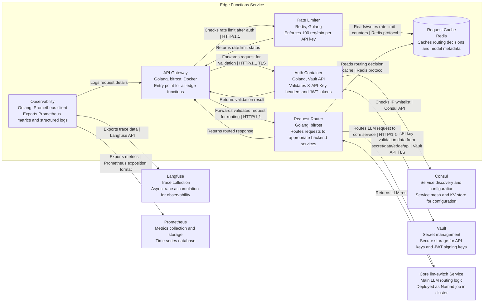

# Edge Functions Container Architecture (C2)

This diagram shows the container-level architecture for the llm-switch edge functions component, which handles API requests at the network edge with authentication, rate limiting, and request routing to the core llm-switch service.

## Container Diagram

## Relationship Descriptions

- **API Gateway to Auth Container**: Forwards incoming requests for authentication validation using HTTP/1.1 with TLS encryption
- **Auth Container to Vault**: Retrieves API key validation data and JWT signing keys (HMAC-SHA256) using Vault API over TLS from path `secret/data/edge/api`
- **Auth Container**: Performs JWT token extraction and expiration validation using HS256 algorithm (returns HTTP 401 with `{"error":"unauthorized","message":"Invalid or expired token","timestamp":"RFC3339"}` for invalid/expired tokens)
- **Auth Container to Consul**: Checks IP address against whitelist configurations and validates permissions stored in Consul KV store (returns HTTP 403 with `{"error":"forbidden","message":"Insufficient permissions","timestamp":"RFC3339"}` for insufficient permissions)
- **API Gateway to Rate Limiter**: Sends authenticated requests for rate limit checking using HTTP/1.1
- **Rate Limiter to Cache**: Reads and writes request counters for rate limiting using Redis protocol (implements token bucket algorithm with 100 requests/minute per API key)
- **API Gateway to Router**: Forwards validated requests to the intelligent routing component using HTTP/1.1
- **Router to Core llm-switch**: Routes LLM requests to the main llm-switch service running as a Nomad job using HTTP/1.1
- **Router to Cache**: Reads cached routing decisions and model metadata from Redis to improve routing performance
- **Observability to Langfuse**: Asynchronously exports trace data for request/response pairs and user feedback via OTLP
- **Observability to Prometheus**: Exposes metrics in Prometheus exposition format for scraping (including `http_requests_total` and `http_request_duration_seconds`)
- **Core llm-switch to Router**: Returns LLM responses back to the router for forwarding to client
- **Router to API Gateway**: Returns routed responses to the API gateway for final delivery to client
- **API Gateway to Auth Container**: Returns authentication validation results (success/failure)
- **Rate Limiter to API Gateway**: Returns current rate limit status and remaining quota information
- **Observability to API Gateway**: Logs request details including timing, routing decisions, and outcomes for debugging in structured JSON format

## Key Architectural Decisions

1. **Authentication Flow**: Uses X-API-Key header validation against Vault-stored keys at exact path `secret/data/edge/api` with JWT token extraction and expiration validation using HS256 algorithm (returns 401 for expired/invalid tokens)
2. **Rate Limiting**: Implements token bucket algorithm with 100 requests/minute per API key using Redis backend
3. **Observability**: Provides Prometheus metrics endpoint (/metrics) and health check endpoint (/health) with structured JSON logging
4. **Security**: Implements mutual TLS for service-to-service communication, IP whitelisting, and CORS restrictions
5. **Error Handling**: Returns standardized error responses:
    - HTTP 401: `{"error":"unauthorized","message":"Invalid or expired token","timestamp":"RFC3339"}`
    - HTTP 403: `{"error":"forbidden","message":"Insufficient permissions","timestamp":"RFC3339"}`
    - HTTP 429: `{"error":"rate_limit_exceeded","message":"Rate limit exceeded","timestamp":"RFC3339"}`
    - HTTP 500: `{"error":"internal_error","message":"Internal server error","timestamp":"RFC3339"}`
    With exponential backoff retry logic (base=100ms, max=5s, maxAttempts=3)
6. **Performance**: Maintains <500ms P99 latency through connection pooling (max_connections=100, timeout=30s) and caching
7. **Scalability**: Designed for horizontal scaling with round-robin load balancing and autoscaling at 80% CPU threshold
8. **Resilience**: Implements circuit breaker pattern with 30s timeout and graceful degradation when dependencies are unavailable