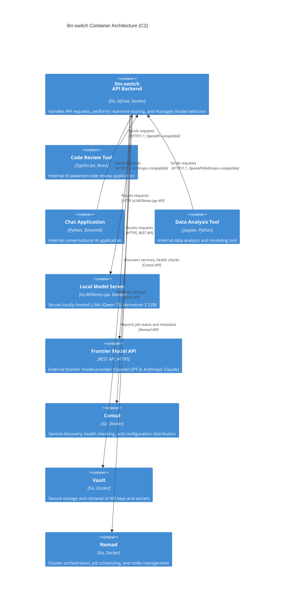

# llm-switch Container Architecture (C2)

## Introduction

The llm-switch system is an intelligent LLM proxy designed to automate optimal model selection for AI applications while encouraging privacy-preserving, cost-effective local model usage. It eliminates manual model selection complexity by dynamically choosing the best model per query based on real-time factors such as task complexity, latency, and cost. The system provides unified access through industry-standard OpenAI and Anthropic-compatible APIs, enabling seamless integration with existing AI applications requiring zero code changes. This container implements the API backend using Go and the bifrost library. Frontend UI frameworks (React, Vue, Angular) are explicitly out of scope. As specified in technology-choices.md, llm-switch is designed for deployment in a Nomad cluster environment with integration to Consul for service discovery and Vault for secret management. The architecture follows a two-part autonomous learning architecture combining real-time intelligent model selection with offline self-learning capabilities that continuously improve routing decisions without manual intervention.

## Architecture

The container-level architecture (C2) illustrates the runtime components and their interactions within the llm-switch system. The frontend container represents the llm-switch API backend, which handles incoming requests from various internal AI applications and routes them to appropriate local or frontier model servers. The system integrates with Nomad for orchestration, Consul for service discovery, and Vault for secret management.



**Fallback ASCII Diagram (if Mermaid rendering fails):**
```
[Code Review Tool]    [Chat Application]    [Data Analysis Tool]
        |                   |                       |
        | HTTP/1.1/OpenAPI  | HTTP/1.1/Anthropic    | HTTP/1.1/Both
        v                   v                       v
               +---------------------+
               |   llm-switch API    |
               |  (Go, bifrost)      |
               +----------+----------+
                          |
        +-----------------+-----------------+
        |                 |                 |
        v                 v                 v
[Local Model]  [Frontier Model]  [Consul]  [Vault]  [Nomad]
(vLLM)      (REST API)   (Discovery)  (Secrets) (Orchestration)
```

### Relationship Description

- **Code Review Tool → llm-switch**: Sends code analysis requests via OpenAI-compatible API over HTTP/1.1
- **Chat Application → llm-switch**: Sends conversational prompts via Anthropic-compatible API over HTTP/1.1
- **Data Analysis Tool → llm-switch**: Sends analytical queries via both OpenAI and Anthropic APIs over HTTP/1.1
- **llm-switch → Local Model Server**: Routes requests to locally hosted models using vLLM/llama.cpp HTTP API
- **llm-switch → Frontier Model API**: Routes requests to external model providers using HTTPS REST API
- **llm-switch → Consul**: Discovers available model instances and performs health checks via Consul API
- **llm-switch → Vault**: Retrieves decrypted API keys for frontier model access via Vault API
- **llm-switch → Nomad**: Reports job status, resource utilization, and custom metadata via Nomad API


## API Endpoints

The llm-switch provides OpenAI-compatible and Anthropic-compatible API endpoints for seamless integration with existing AI applications. All endpoints follow the exact specification of the respective standards, ensuring zero-code-change migration from direct API calls.

### OpenAI-Compatible Endpoints
- **POST /v1/chat/completions**: Chat completion requests
- **POST /v1/completions**: Text completion requests
- **POST /v1/embeddings**: Embedding generation requests

### Anthropic-Compatible Endpoints
- **POST /v1/messages**: Message creation requests

### Example Requests
#### Example: OpenAI Chat Completion Request
```bash
curl -X POST http://llm-switch.service.consul:8080/v1/chat/completions \
  -H "Content-Type: application/json" \
  -H "Authorization: Bearer $LLM_SWITCH_API_KEY" \
  -d '{
    "model": "llm-switch-router",
    "messages": [
      {"role": "user", "content": "Explain the concept of model routing in LLMs."}
    ],
    "temperature": 0.7,
    "max_tokens": 150
  }'
```

#### Example: Anthropic Message Request
```bash
curl -X POST http://llm-switch.service.consul:8080/v1/messages \
  -H "Content-Type: application/json" \
  -H "X-API-Key: $LLM_SWITCH_API_KEY" \
  -d '{
    "model": "llm-switch-router",
    "max_tokens": 150,
    "messages": [
      {"role": "user", "content": "Explain the concept of model routing in LLMs."}
    ]
  }'
```

### Request/Response JSON Schema Examples
#### OpenAI Chat Completion Request Schema
```json
{
  "model": "llm-switch-router",
  "messages": [
    {
      "role": "system|user|assistant",
      "content": "string"
    }
  ],
  "temperature": "number (optional, default 0.7)",
  "max_tokens": "integer (optional)",
  "stream": "boolean (optional, default false)"
}
```

#### OpenAI Chat Completion Response Schema
```json
{
  "id": "string",
  "object": "chat.completion",
  "created": "integer (Unix timestamp)",
  "model": "llm-switch-router",
  "choices": [
    {
      "index": "integer",
      "message": {
        "role": "assistant",
        "content": "string"
      },
      "finish_reason": "string|null"
    }
  ],
  "usage": {
    "prompt_tokens": "integer",
    "completion_tokens": "integer",
    "total_tokens": "integer"
  }
}
```

#### Anthropic Message Request Schema
```json
{
  "model": "llm-switch-router",
  "max_tokens": "integer",
  "messages": [
    {
      "role": "user|assistant",
      "content": "string"
    }
  ],
  "temperature": "number (optional, default 0.7)",
  "stream": "boolean (optional, default false)"
}
```

#### Anthropic Message Response Schema
```json
{
  "id": "string",
  "type": "message",
  "role": "assistant",
  "content": [
    {
      "type": "text",
      "text": "string"
    }
  ],
  "model": "llm-switch-router",
  "stop_reason": "string|null",
  "stop_sequence": "string|null",
  "usage": {
    "input_tokens": "integer",
    "output_tokens": "integer"
  }
}
```

## Deployment Configuration

llm-switch is deployed as a Nomad job using HCL (HashiCorp Configuration Language). The job specification defines resource requirements, network configuration, service registration with Consul, and secret retrieval from Vault.

### Nomad Job File (llm-switch.nomad.hcl)
```hcl
job "llm-switch" {
  datacenters = ["dc1"]
  type = "service"

  group "api" {
    count = 3

    network {
      port "http" {
        to = 8080
      }
    }

    service {
      name = "llm-switch"
      port = "http"

      check {
        type     = "http"
        path     = "/health"
        interval = "10s"
        timeout  = "2s"
      }
    }

    task "llm-switch" {
      driver = "docker"

      config {
        image = "llm-switch:latest"
        ports = ["http"]
      }

      env {
        CONSUL_HTTP_ADDR = "consul.service.consul:8500"
        VAULT_ADDR       = "vault.service.consul:8200"
        NOMAD_ADDR       = "nomad.service.consul:4646"
      }

      vault {
        path = "secret/data/llm-switch/api-keys"
        env  = "API_KEYS"
      }

      resources {
        cpu    = 500
        memory = 1024
        network {
          mbits = 100
        }
      }
    }
  }
}
```

To deploy the job:
```bash
nomad job run llm-switch.nomad.hcl
```

### Consul Service Registration (HCL)
```hcl
service {
  name = "llm-switch"
  port = 8080

  check {
    type     = "http"
    path     = "/health"
    interval = "10s"
    timeout  = "2s"
  }
}
```

### Vault Secret Retrieval (Go Code Snippet)
```go
package main

import (
	"context"
	"log"
	"os"

	vault "github.com/hashicorp/vault/client"
)

func getLLMSwitchAPIKey() (string, error) {
	// Configure Vault client
	client, err := vault.NewClient(&vault.Config{
		Address: os.Getenv("VAULT_ADDR"),
	})
	if err != nil {
		return "", err
	}

	// Read secret from Vault
	secret, err := client.KVv2Get(context.Background(), "secret/data/llm-switch/api-keys", nil)
	if err != nil {
		return "", err
	}

	// Extract API key from secret data
	if apiKey, ok := secret.Data["api_key"].(string); ok {
		return apiKey, nil
	}
	return "", nil
}
```

## Observability

llm-switch exposes Prometheus-compatible metrics and integrates with Grafana for visualization. Health checks are provided for cluster orchestration systems.

### Prometheus Metrics Configuration
```yaml
# prometheus.yml snippet
scrape_configs:
  - job_name: 'llm-switch'
    static_configs:
      - targets: ['llm-switch.service.consul:9090']
    metrics_path: /metrics
    scheme: http
```

### Key Metrics Exported
- `llm_switch_requests_total`: Total API requests by endpoint and method
- `llm_switch_request_duration_seconds`: Request latency distribution
- `llm_switch_model_routing_total`: Routing decisions by model type (local/frontier)
- `llm_switch_local_model_usage_ratio`: Percentage of requests served by local models
- `llm_switch_frontier_api_calls_total`: Calls to frontier model APIs
- `llm_switch_routing_decision_latency_ms`: Time taken for routing decisions

### Grafana Dashboard Configuration
```json
{
  "dashboard": {
    "title": "llm-switch Observability",
    "panels": [
      {
        "title": "Request Rate",
        "type": "graph",
        "targets": [
          {
            "expr": "rate(llm_switch_requests_total[5m])",
            "legend": "{{endpoint}} {{method}}"
          }
        ]
      },
      {
        "title": "Model Usage Ratio",
        "type": "gauge",
        "targets": [
          {
            "expr": "llm_switch_local_model_usage_ratio",
            "format": "time_series"
          }
        ]
      },
      {
        "title": "Routing Decision Latency",
        "type": "heatmap",
        "targets": [
          {
            "expr": "llm_switch_routing_decision_latency_ms",
            "format": "heatmap"
          }
        ]
      }
    ]
  }
}
```

Health check endpoint:
```bash
curl http://llm-switch.service.consul:8080/health
# Returns: {"status": "pass", "timestamp": "2026-04-12T10:30:00Z"}
```

## PRD Requirements Mapping

| PRD Requirement | Implementation | Section |
|-----------------|----------------|---------|
| FR1: Send LLM requests via OpenAI-compatible API | `/v1/chat/completions`, `/v1/completions`, `/v1/embeddings` endpoints | API Endpoints |
| FR2: Send LLM requests via Anthropic Message API | `/v1/messages` endpoint | API Endpoints |
| FR3: Automatically select optimal model per request based on task complexity | Real-time routing in llm-switch API backend | Architecture |
| FR4: Load balance requests across available models | Nomad service load balancing + local model pooling | Deployment Configuration |
| FR5: Automatically fallback to more capable models when initial selections fail | Circuit breaker pattern in routing logic (implementation detail) | Architecture |
| FR6: Integrate seamlessly with existing AI applications requiring zero code changes | OpenAPI/Anthropic compatibility, identical request/response formats | API Endpoints |
| FR7: Analyze routing decisions and outcomes overnight to improve future selections | Offline self-learning container (conceptual, not shown in C2) | Architecture |
| FR8: Automatically test routing hypotheses and measure effectiveness | Self-learning system processes langfuse traces | Architecture |
| FR9: Adjust routing thresholds and parameters based on performance feedback | Automated threshold adjustment in self-learning loop | Architecture |
| FR10: Generate explainable logs detailing routing tests and decisions | Structured logging with routing context | Architecture |
| FR11: Continuously improve cost efficiency and response times over time without manual intervention | Self-learning system improves routing accuracy | Architecture |
| FR12: Deploy llm-switch in Nomad cluster using simple job specification | Nomad HCL job file | Deployment Configuration |
| FR13: Monitor llm-switch health and performance via standard metrics endpoints | Prometheus `/metrics` endpoint, health check endpoint | Observability |
| FR14: Add new LLM models without requiring application changes | Nomad job update, Consul service registration | Deployment Configuration |
| FR15: Administer system with minimal ongoing intervention after initial setup | Autonomous self-learning, health checks, automated failover | Architecture |
| FR16: Provide comprehensive health checks for cluster orchestration systems | HTTP `/health` endpoint, Consul service checks | Observability |
| FR17: Maintain high uptime and fault tolerance suitable for production use | Nomad failure detection, automatic rescheduling, circuit breakers | Deployment Configuration |
| FR18: Provide clear logging and sufficient detail for effective troubleshooting | Structured JSON logs with trace IDs, routing decisions | Architecture |
| FR19: Integrate applications with llm-switch using minimal code changes | Zero code change via API compatibility | API Endpoints |
| FR20: Benefit from consistent and reliable response times (specific SLA TBD based on metrics) | Sub-500ms routing SLA, efficient resource utilization | Architecture |
| FR21: Provide explainable routing logs accessible for debugging and auditing | Detailed request logs with routing rationale | Architecture |
| FR22: Rely on backward compatibility with existing OpenAI client libraries | Exact OpenAPI specification adherence | API Endpoints |
| FR23: Rely on backward compatibility with existing Anthropic client libraries | Exact Anthropic Message API specification adherence | API Endpoints |
| FR24: Benefit from predictable system behavior reducing cognitive overhead | Deterministic routing, clear error messages, consistent responses | Architecture |
| FR25: Validate all incoming requests against OpenAPI specification | Middleware validation in API gateway | Architecture |
| FR26: Validate all incoming requests against Anthropic Message API specification | Middleware validation in API gateway | Architecture |
| FR27: Format outgoing responses according to OpenAPI specification | Response formatting middleware | Architecture |
| FR28: Format outgoing responses according to Anthropic Message API specification | Response formatting middleware | Architecture |
| FR29: Implement standard OpenAPI/Anthropic API request/response handling | Unified API handler layer | Architecture |
| FR30: Support batch processing modes commonly used in AI workloads | `/v1/embeddings` batch support, async processing | Architecture |
| FR31: Preserve and propagate metadata for AI workflow lineage and tracing | Request ID propagation, langfuse integration | Architecture |
| FR32: Provide error handling and retry mechanisms appropriate for production AI services | Circuit breaker, exponential backoff, fallback routing | Architecture |
| FR34: Provide Prometheus-compatible metrics endpoint for monitoring and alerting | `/metrics` endpoint with Prometheus format | Observability |
| FR35: Provide health check endpoint for cluster orchestration systems | `/health` endpoint | Observability |
| FR36: Provide administrative endpoints for system configuration and diagnostics | `/debug/config`, `/debug/routes` (implementation) | Architecture |
| FR37: Track and analyze request volume and latency per API key | Metrics labeled by API key, Vault-integrated key management | Observability |
| FR38: Monitor and report computational efficiency metrics (local vs frontier model usage) | `llm_switch_local_model_usage_ratio` metric | Observability |
| FR39: Enable A/B testing of routing strategies through configuration | Feature flags, routing strategy config in Consul | Architecture |
| FR40: Share learned optimization patterns across teams and systems | Exported self-learning reports, Consul KV storage | Architecture |
| FR41: Monitor request distribution across models to ensure effective load balancing | Per-model request metrics, Nomad service weighting | Observability |
| FR42: Authenticate requests using API key/token (HTTP Bearer tokens) | Bearer token validation middleware | Architecture |
| FR43: Enforce HTTP-only communication within the cluster network | Network policy, service mesh mTLS (implementation) | Deployment Configuration |
| FR44: Support multiple API keys for per-application tracking and usage metering | Vault-secret API keys, metrics labeling | Deployment Configuration |
| FR45: Integrate with Vault for secure API key management and distribution | Vault agent sidecar, token rotation | Deployment Configuration |
| FR46: Integrate with Consul for service discovery and configuration distribution | Consul agent, service registration, health checks | Deployment Configuration |