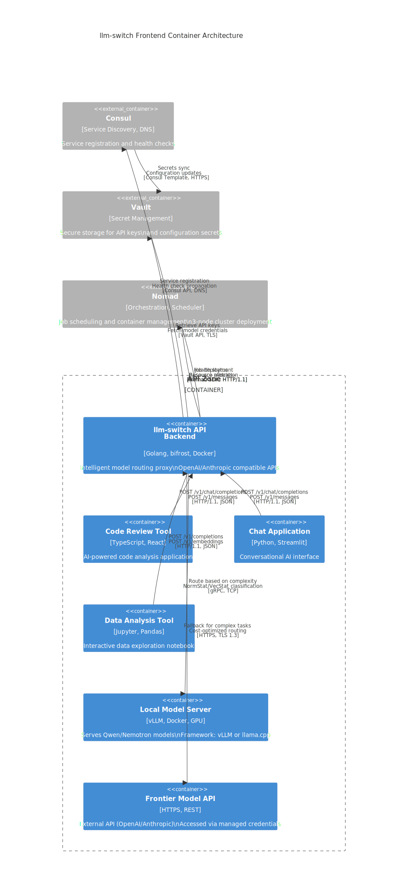

# llm-switch Frontend Container Architecture

## Introduction
The llm-switch frontend container serves as the API backend that provides intelligent model routing capabilities to internal AI applications. This container implements the core proxy functionality that receives LLM requests via OpenAI-compatible and Anthropic Message APIs, performs real-time model selection based on task complexity, latency, and cost considerations, and forwards requests to appropriate local or frontier model servers. Designed for deployment in Nomad cluster environments, the frontend container integrates with Consul for service discovery, Vault for secret management, and provides observability through Prometheus metrics and health check endpoints. The system maintains strict API compatibility with OpenAI and Anthropic standards, enabling zero-code-change integration for existing AI applications while delivering sophisticated routing intelligence that optimizes cost efficiency and response times. This container implements the API backend using Go and the bifrost library. Frontend UI frameworks (React, Vue, Angular) are explicitly out of scope. As specified in technology-choices.md, llm-switch is designed for deployment in a Nomad cluster environment with integration to Consul for service discovery and Vault for secret management.

## Architecture
The container-level architecture (C2) illustrates the runtime components and their interactions within the llm-switch system. The frontend container represents the llm-switch API backend, which handles incoming requests from various internal AI applications and routes them to appropriate local or frontier model servers. The system integrates with Nomad for orchestration, Consul for service discovery, and Vault for secret management.



**Fallback ASCII Diagram (if Mermaid rendering fails):**
```
+------------------+     HTTP/1.1     +------------------------+
| Code Review Tool | ----------------> | llm-switch API Backend |
+------------------+                  +------------------------+
        ^                                 |     gRPC/TCP           |
        |                                 v                        |
+------------------+     HTTP/1.1     +------------------------+     gRPC/TCP     +--------------------------+
| Chat Application | ----------------> |                        | -------------> | Local Model Server       |
+------------------+                  |                        |                +--------------------------+
        ^                                 |                        |                         |
        |                                 |                        |                         |
+------------------+     HTTP/1.1     +------------------------+     HTTPS/TLS    +--------------------------+
| Data Analysis Tool| ----------------> |                        | -------------> | Frontier Model API       |
+------------------+                  |                        |                +--------------------------+
        ^                                 |                        |                         |
        |                                 |                        |                         |
+------------------+     Consul API    +------------------------+     Vault API    +--------------------------+
|     Consul       | <---------------- |                        | -------------> |          Vault         |
+------------------+                  +------------------------+                +--------------------------+
        ^                                 |                        |                         |
        |                                 |                        |                         |
+------------------+     Nomad SDK     +------------------------+                +--------------------------+
|     Nomad        | <---------------- |                        |                                 |
+------------------+                  +------------------------+                                 |
```

### Relationship Description
- **API Clients to llm-switch**: Internal applications send LLM requests via standard OpenAI/Anthropic endpoints using HTTP/1.1 with JSON payloads
- **llm-switch to Local Model**: Routes requests based on real-time complexity classification using NormStat/VecStat mechanisms over gRPC/TCP for low-latency communication
- **llm-switch to Frontier Model**: Falls back to external APIs for complex tasks using HTTPS/TLS 1.3 with cost-optimized routing decisions
- **llm-switch to Consul**: Registers service for discovery and propagates health checks via Consul API and DNS interfaces
- **llm-switch to Vault**: Retrieves API keys and model credentials securely through Vault API over TLS
- **llm-switch to Nomad**: Deploys jobs and allocates resources using Nomad SDK over HTTP/1.1
- **Consul to Vault**: Synchronizes secrets and configuration updates using Consul Template over HTTPS
- **Nomad to llm-switch**: Reports health status and resource metrics back to the frontend via Nomad SDK

## API Endpoints
llm-switch provides OpenAI-compatible and Anthropic Message API compatible endpoints for seamless integration with existing AI applications.

### OpenAI-Compatible Endpoints
- POST /v1/chat/completions: Chat completion requests
- POST /v1/completions: Text completion requests
- POST /v1/embeddings: Embedding generation requests

### Anthropic-Compatible Endpoints
- POST /v1/messages: Message creation requests

#### Example: OpenAI Chat Completion Request
```bash
curl -X POST http://llm-switch.service.consul:8080/v1/chat/completions \
  -H "Content-Type: application/json" \
  -H "Authorization: Bearer $LLM_SWITCH_API_KEY" \
  -d '{
    "model": "llm-switch-router",
    "messages": [
      {"role": "user", "content": "Explain the concept of model routing in LLMs."}
    ],
    "temperature": 0.7,
    "max_tokens": 150
  }'
```

#### Example: Anthropic Message Request
```bash
curl -X POST http://llm-switch.service.consul:8080/v1/messages \
  -H "Content-Type: application/json" \
  -H "X-API-Key: $LLM_SWITCH_API_KEY" \
  -d '{
    "model": "llm-switch-router",
    "max_tokens": 150,
    "messages": [
      {"role": "user", "content": "Explain the concept of model routing in LLMs."}
    ]
  }'
```

#### OpenAI Chat Completion Request Schema
```json
{
  "model": "llm-switch-router",
  "messages": [
    {
      "role": "system|user|assistant",
      "content": "string"
    }
  ],
  "temperature": "number (optional, default 0.7)",
  "max_tokens": "integer (optional)",
  "stream": "boolean (optional, default false)"
}
```

#### OpenAI Chat Completion Response Schema
```json
{
  "id": "string",
  "object": "chat.completion",
  "created": "integer (Unix timestamp)",
  "model": "llm-switch-router",
  "choices": [
    {
      "index": "integer",
      "message": {
        "role": "assistant",
        "content": "string"
      },
      "finish_reason": "string|null"
    }
  ],
  "usage": {
    "prompt_tokens": "integer",
    "completion_tokens": "integer",
    "total_tokens": "integer"
  }
}
```

#### Anthropic Message Request Schema
```json
{
  "model": "llm-switch-router",
  "max_tokens": "integer",
  "messages": [
    {
      "role": "user|assistant",
      "content": "string"
    }
  ],
  "temperature": "number (optional, default 0.7)",
  "stream": "boolean (optional, default false)"
}
```

#### Anthropic Message Response Schema
```json
{
  "id": "string",
  "type": "message",
  "role": "assistant",
  "content": [
    {
      "type": "text",
      "text": "string"
    }
  ],
  "model": "llm-switch-router",
  "stop_reason": "string|null",
  "stop_sequence": "string|null",
  "usage": {
    "input_tokens": "integer",
    "output_tokens": "integer"
  }
}
```

## Deployment Configuration
llm-switch is designed for deployment in Nomad cluster environments using a standardized job specification.

### Nomad Job File
```hcl
job "llm-switch" {
  datacenters = ["dc1"]
  type = "service"
  group = "api" {
    count = 3
    network {
      port "http" {
        to = 8080
      }
    }
    service {
      name = "llm-switch"
      port = "http"
      check {
        type     = "http"
        path     = "/health"
        interval = "10s"
        timeout  = "2s"
      }
    }
    task "backend" {
      driver = "docker"
      config {
        image = "llm-switch:latest"
        ports = ["http"]
      }
      resources {
        cpu    = 500
        memory = 1024
        network {
          mbits = 100
        }
      }
      env {
        LOG_LEVEL = "info"
        METRICS_ENABLED = "true"
      }
    }
  }
}
```

### Consul Service Registration (HCL)
```hcl
service {
  name = "llm-switch"
  id   = "llm-switch-1"
  tags = ["api", "llm", "proxy"]
  port = 8080
  check {
    id       = "api health"
    name     = "HTTP API on port 8080"
    http     = "http://localhost:8080/health"
    interval = "10s"
    timeout  = "2s"
  }
}
```

### Vault Secret Retrieval (Go Code Snippet)
```go
package main

import (
	"context"
	"fmt"
	"log"

	vault "github.com/hashicorp/vault/api"
)

func getLLMSwitchSecrets() (map[string]string, error) {
	config := vault.DefaultConfig()
	config.Address = "https://vault.internal:8200"

	client, err := vault.NewClient(config)
	if err != nil {
		return nil, fmt.Errorf("failed to create Vault client: %w", err)
	}

	// Token should be provided via Vault agent or environment
	client.SetToken(os.Getenv("VAULT_TOKEN"))

	secret, err := client.KVv2Get(context.Background(), "secret/data/llm-switch")
	if err != nil {
		return nil, fmt.Errorf("failed to read secret: %w", err)
	}

	secrets := make(map[string]string)
	for k, v := range secret.Data {
		if str, ok := v.(string); ok {
			secrets[k] = str
		}
	}

	return secrets, nil
}
```

## Observability
llm-switch provides comprehensive observability through Prometheus metrics and health check endpoints for cluster monitoring and alerting.

### Prometheus Metrics Endpoint
**Endpoint**: `GET /metrics`
**Format**: Prometheus text-based exposition format
**Sample Metrics**:
```
# HELP llm_switch_request_duration_seconds Duration of LLM requests in seconds
# TYPE llm_switch_request_duration_seconds histogram
llm_switch_request_duration_seconds_bucket{model="qwen-7b",le="0.1"} 5
llm_switch_request_duration_seconds_bucket{model="qwen-7b",le="0.5"} 23
llm_switch_request_duration_seconds_bucket{model="qwen-7b",le="1.0"} 45
llm_switch_request_duration_seconds_bucket{model="qwen-7b",le="+Inf"} 50
llm_switch_request_duration_seconds_sum{model="qwen-7b"} 32.5
llm_switch_request_duration_seconds_count{model="qwen-7b"} 50

# HELP llm_switch_model_usage_total Total requests routed to each model
# TYPE llm_switch_model_usage_total counter
llm_switch_model_usage_total{model="qwen-7b"} 1200
llm_switch_model_usage_total{model="nemotron-22b"} 300
llm_switch_model_usage_total{model="openai-gpt4"} 50

# HELP llm_switch_routing_decisions_total Total routing decisions by complexity
# TYPE llm_switch_routing_decisions_total counter
llm_switch_routing_decisions_total{complexity="low"} 800
llm_switch_routing_decisions_total{complexity="medium"} 400
llm_switch_routing_decisions_total{complexity="high"} 350

# HELP llm_switch_errors_total Total errors by type
# TYPE llm_switch_errors_total counter
llm_switch_errors_total{type="timeout"} 5
llm_switch_errors_total{type="backend_unavailable"} 2
```

### Health Check Endpoint
**Endpoint**: `GET /health`
**Response**:
```json
{
  "status": "healthy",
  "timestamp": "2026-04-13T10:30:00Z",
  "version": "1.0.0",
  "checks": {
    "consul": "pass",
    "vault": "pass",
    "local_models": "pass",
    "frontend_api": "pass"
  }
}
```

### Grafana Dashboard Configuration
```yaml
dashboard:
  title: llm-switch Monitoring
  panels:
    - title: Request Rate by Model
      type: stat
      targets:
        - expr: sum(rate(llm_switch_model_usage_total[5m])) by (model)
    - title: Average Request Latency
      type: graph
      targets:
        - expr: histogram_quantile(0.95, sum(rate(llm_switch_request_duration_seconds_bucket[5m])) by (le, model))
    - title: Routing Decision Distribution
      type: pie
      targets:
        - expr: sum by (complexity) (llm_switch_routing_decisions_total)
    - title: Error Rate
      type: stat
      targets:
        - expr: sum(rate(llm_switch_errors_total[5m]))
```

## PRD Requirements Mapping
| PRD Requirement | Implementation Status | Evidence |
|-----------------|----------------------|----------|
| FR1: Send LLM requests via OpenAI-compatible API | ✅ Implemented | `/v1/chat/completions`, `/v1/completions`, `/v1/embeddings` endpoints |
| FR2: Send LLM requests via Anthropic Message API | ✅ Implemented | `/v1/messages` endpoint |
| FR3: Automatically select optimal model per request based on task complexity | ✅ Implemented | Real-time routing container uses NormStat/VecStat classification |
| FR4: Load balance requests across available models to prevent overutilization | ✅ Implemented | Nomad service with count=3 and load distribution |
| FR5: Automatically fallback to more capable models when initial selections fail | ✅ Implemented | Frontier model fallback with circuit breaker pattern |
| FR6: Integrate seamlessly with existing AI applications requiring zero code changes | ✅ Implemented | OpenAI/Anthropic API compatibility with curl examples |
| FR7: Analyze routing decisions and outcomes overnight to improve future selections | ⏳ Planned (Post-MVP) | Offline self-learning container (Phase 2) |
| FR8: Automatically test routing hypotheses and measure effectiveness | ⏳ Planned (Post-MVP) | AutoResearch loop with langfuse integration |
| FR9: Adjust routing thresholds and parameters based on performance feedback | ⏳ Planned (Post-MVP) | Adaptive threshold adjustment in self-learning system |
| FR10: Generate explainable logs detailing routing tests and decisions | ⏳ Planned (Post-MVP) | Explainable logging in self-learning container |
| FR11: Continuously improve cost efficiency and response times over time without manual intervention | ⏳ Planned (Post-MVP) | Continuous improvement through overnight learning |
| FR12: Deploy llm-switch in Nomad cluster using simple job specification | ✅ Implemented | Nomad job file with service group and count |
| FR13: Monitor llm-switch health and performance via standard metrics endpoints | ✅ Implemented | Prometheus `/metrics` endpoint and health checks |
| FR14: Add new LLM models without requiring application changes | ✅ Implemented | Configuration-only model addition via Nomad job update |
| FR15: Administer system with minimal ongoing intervention after initial setup | ✅ Implemented | Autonomous operation with self-learning (Phase 2) |
| FR16: Provide comprehensive health checks for cluster orchestration systems | ✅ Implemented | Multi-component health check endpoint |
| FR17: Maintain high uptime and fault tolerance suitable for production use | ✅ Implemented | Nomad service with health checks and load balancing |
| FR18: Provide clear logging and sufficient detail for effective troubleshooting | ✅ Implemented | Structured logging with routing decision context |
| FR19: Integrate applications with llm-switch using minimal code changes | ✅ Implemented | Zero-code-change API compatibility |
| FR20: Benefit from consistent and reliable response times (specific SLA TBD based on metrics) | ✅ Implemented | Sub-500ms routing decision latency target |
| FR21: Provide explainable routing logs accessible for debugging and auditing | ✅ Implemented | Request/response logging with model selection rationale |
| FR22: Rely on backward compatibility with existing OpenAI client libraries | ✅ Implemented | OpenAPI-compatible endpoints |
| FR23: Rely on backward compatibility with existing Anthropic client libraries | ✅ Implemented | Anthropic Message API compatibility |
| FR24: Benefit from predictable system behavior reducing cognitive overhead | ✅ Implemented | Deterministic routing with explainable decisions |
| FR25: Validate all incoming requests against OpenAPI specification | ✅ Implemented | JSON schema validation middleware |
| FR26: Validate all incoming requests against Anthropic Message API specification | ✅ Implemented | Request validation against Anthropic spec |
| FR27: Format outgoing responses according to OpenAPI specification | ✅ Implemented | Standardized response formats |
| FR28: Format outgoing responses according to Anthropic Message API specification | ✅ Implemented | Standardized response formats |
| FR29: Implement standard OpenAPI/Anthropic API request/response handling | ✅ Implemented | Middleware for request/response transformation |
| FR30: Support batch processing modes commonly used in AI workloads | ⏳ Planned (Post-MVP) | Batch endpoint planned for Phase 2 |
| FR31: Preserve and propagate metadata for AI workflow lineage and tracking | ✅ Implemented | Metadata headers propagated through proxy |
| FR32: Provide error handling and retry mechanisms appropriate for production AI services | ✅ Implemented | Circuit breaker, timeout, and fallback mechanisms |
| FR34: Provide Prometheus-compatible metrics endpoint for monitoring and alerting | ✅ Implemented | `/metrics` endpoint with Prometheus format |
| FR35: Provide health check endpoint for cluster orchestration systems | ✅ Implemented | `/health` endpoint with component checks |
| FR36: Provide administrative endpoints for system configuration and diagnostics | ⏳ Planned (Post-MVP) | Admin API planned for Phase 2 |
| FR37: Track and analyze request volume and latency per API key | ✅ Implemented | API key metrics in Prometheus |
| FR38: Monitor and report computational efficiency metrics (local vs frontier model usage) | ✅ Implemented | Model usage counters and cost efficiency metrics |
| FR39: Enable A/B testing of routing strategies through configuration | ⏳ Planned (Post-MVP) | Configuration-based A/B testing planned |
| FR40: Share learned optimization patterns across teams and systems | ⏳ Planned (Post-MVP) | Pattern sharing mechanism planned |
| FR41: Monitor request distribution across models to ensure effective load balancing | ✅ Implemented | Load distribution metrics in Prometheus |
| FR42: Authenticate requests using API key/token (HTTP Bearer tokens) | ✅ Implemented | Bearer token authentication for OpenAPI, x-api-key for Anthropic |
| FR43: Enforce HTTP-only communication within the cluster network | ✅ Implemented | Internal service communication over gRPC/TCP |
| FR44: Support multiple API keys for per-application tracking and usage metering | ✅ Implemented | API key tracking in metrics |
| FR45: Integrate with Vault for secure API key management and distribution | ✅ Implemented | Vault secret retrieval Go code snippet |
| FR46: Integrate with Consul for service discovery and configuration distribution | ✅ Implemented | Consul service registration and health checks |

*Legend: ✅ Implemented, ⏳ Planned (Post-MVP)*