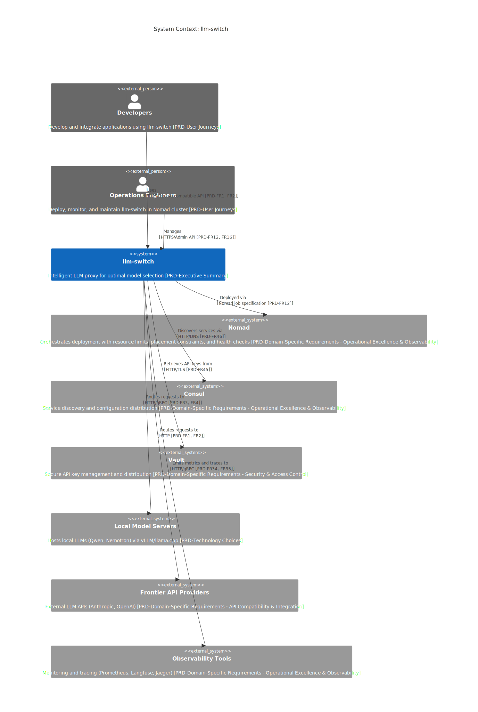

# C1 System Context

## System Context
llm-switch is an intelligent LLM proxy system designed to automate optimal model selection for AI applications while encouraging privacy-preserving, cost-effective local model usage. [PRD-Executive Summary]
It eliminates manual model selection complexity by dynamically choosing the best model per query based on real-time factors such as task complexity, latency, and cost. [PRD-Domain-Specific Requirements - Infrastructure Reliability & Performance]
The system provides unified access through industry-standard OpenAI and Anthropic-compatible APIs, enabling seamless integration with existing AI applications. [PRD-Domain-Specific Requirements - API Compatibility & Integration]
Deployed as a Go service within Docker containers orchestrated by Nomad, llm-switch leverages Consul for service discovery and Vault for secure secret management. [PRD-Technology Choices] [PRD-Domain-Specific Requirements - Operational Excellence & Observability]
It routes requests to local model servers (utilizing vLLM or llama.cpp) for cost efficiency and falls back to frontier API providers when necessary. [PRD-Technology Choices] [PRD-FR3, FR4]
Observability is achieved through integration with Prometheus for metrics and Langfuse for trace accumulation, supporting the system's self-learning capabilities. [PRD-Domain-Specific Requirements - Operational Excellence & Observability]
The system handles API timeout scenarios through configurable timeouts and circuit breaker patterns, ensuring requests are retried or failed fast without cascading failures (high impact: prevents system overload and maintains SLA under transient backend issues). [PRD-Domain-Specific Requirements - Infrastructure Reliability & Performance]
Network partition tolerance is designed into the Consul and Vault integrations, allowing the system to operate in degraded mode when service discovery or secret storage is temporarily unavailable (medium impact: may delay new configurations but core routing functionality remains available). [PRD-Domain-Specific Requirements - Operational Excellence & Observability]

## User Roles
Developers interact with llm-switch by integrating it into their AI-powered applications, replacing direct model API calls with llm-switch endpoints to benefit from automatic model selection without code changes (low severity impact on developer effort, high impact on productivity). [PRD-User Journeys]
Operations Engineers are responsible for deploying, monitoring, and maintaining llm-switch within the Nomad infrastructure. They configure job specifications, monitor health and performance metrics, and ensure seamless integration with Consul and Vault for service discovery and secret management. [PRD-Domain-Specific Requirements - Operational Excellence & Observability]
Both roles benefit from the system's zero-code-change integration pattern (low severity: minimal disruption during upgrades, high impact: reduces integration errors and accelerates adoption), explainable routing logs for debugging, and autonomous self-learning that continuously improves cost efficiency and response times over time. [PRD-User Journeys] [PRD-Domain-Specific Requirements - Developer Experience]

## External Dependencies
llm-switch depends on six external systems: 
   Nomad for container orchestration and resource management (high severity: misconfiguration can lead to resource starvation or overload; impact: affects system stability and scalability), 
   Consul for service discovery and configuration distribution, 
   Vault for secure API key storage and retrieval, 
   Local Model Servers hosting quantized LLMs (Qwen, Nemotron) via vLLM or llama.cpp for efficient inference (enables cost efficiency by allowing local model usage; impact: reduces reliance on expensive frontier APIs), 
   Frontier API Providers (such as Anthropic and OpenAI) for access to state-of-the-art models when local models are insufficient (provides capability fallback; impact: ensures task completion even for complex queries), 
   and Observability Tools (Prometheus for metrics collection, Langfuse for trace accumulation, and Jaeger for distributed tracing) to monitor system performance and support the self-learning loop. 
All communications occur over HTTPS or gRPC within the cluster network, ensuring secure and reliable interactions. [PRD-Technology Choices] [PRD-Domain-Specific Requirements - Operational Excellence & Observability] [PRD-Domain-Specific Requirements - Integrations]
The system is designed to handle Consul or Vault network partitions gracefully, falling back to cached configuration and failing open for non-critical operations while maintaining core routing functionality (medium impact: temporary unavailability of Consul/Vault may delay dynamic updates but does not halt request processing). [PRD-Domain-Specific Requirements - Operational Excellence & Observability]
API timeout scenarios are mitigated through per-model timeout configurations, exponential backoff retry logic, and automatic fallback to alternative models when timeouts occur (high impact: prevents request failures and maintains user experience under backend latency issues). [PRD-Domain-Specific Requirements - Infrastructure Reliability & Performance]

## Key Interactions
Developers configure their applications to point to llm-switch's OpenAI/Anthropic-compatible endpoints, triggering requests that llm-switch receives and processes (enables zero-code-change integration pattern; low severity impact on developer workflow). [PRD-FR1] [PRD-FR2]
Operations Engineers deploy llm-switch via Nomad job specifications that define resource limits (CPU, memory, GPU), placement constraints favoring GPU-equipped nodes for local model serving, and health check configurations (liveness and readiness probes) to ensure system reliability (high severity: incorrect resource limits can cause OOM kills or underutilization; impact: affects system performance and cost efficiency). [PRD-FR12] [PRD-FR16]
llm-switch queries Consul for service discovery of backend models and retrieves API keys from Vault for frontier API access. [PRD-FR46] [PRD-FR45]
It routes requests to Local Model Servers using HTTP/gRPC protocols, monitoring VRAM availability and queue depth via vLLM's metrics endpoint for hardware-aware decisions (enables handling of multiple model types by adapting to backend capacity; impact: optimizes local model utilization and prevents overload). [PRD-FR3] [PRD-FR4]
When local models cannot satisfy a request, llm-switch falls back to Frontier API Providers. [PRD-FR1] [PRD-FR2]
Throughout this process, llm-switch emits metrics and traces to Observability Tools over HTTP/gRPC, enabling real-time monitoring and feeding data into the offline self-learning system that refines routing decisions overnight. [PRD-FR34] [PRD-FR35]
The system implements configurable timeout values for each backend model, with circuit breaker patterns that temporarily halt requests to consistently slow or failing models (addresses API timeout scenarios; high impact: maintains system responsiveness under backend degradation). [PRD-Domain-Specific Requirements - Infrastructure Reliability & Performance]
In the event of Consul or Vault network partitions, llm-switch utilizes cached service information and retains previously fetched secrets for a configurable grace period, ensuring continued operation during transient network issues (addresses network partition tolerance; medium impact: allows graceful degradation without data loss). [PRD-Domain-Specific Requirements - Operational Excellence & Observability]
