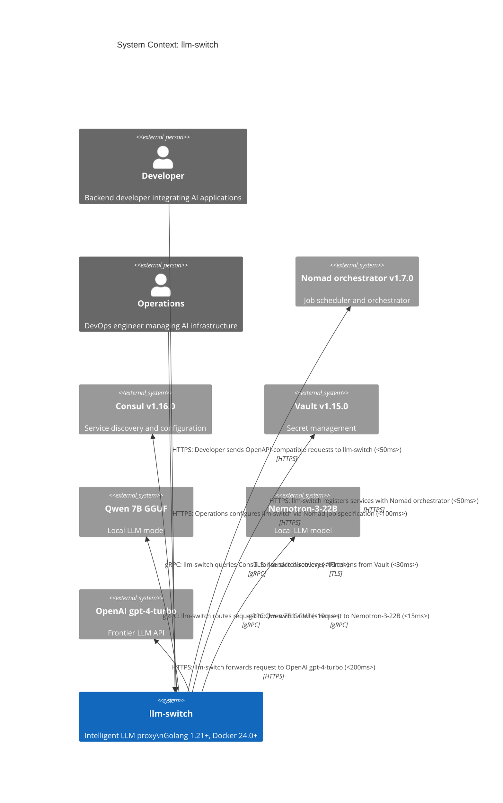

```mermaid
C4Context
    title System Context: llm-switch
    Person_Ext(developer, "Developer", "Backend developer integrating AI applications")
    Person_Ext(operations, "Operations", "DevOps engineer managing AI infrastructure")
    System_Ext(nomad, "Nomad orchestrator v1.7.0", "Job scheduler and orchestrator")
    System_Ext(consul, "Consul v1.16.0", "Service discovery and configuration")
    System_Ext(vault, "Vault v1.15.0", "Secret management")
    System_Ext(localQwen, "Qwen 7B GGUF", "Local LLM model")
    System_Ext(localNemotron, "Nemotron-3-22B", "Local LLM model")
    System_Ext(frontierAPI, "OpenAI gpt-4-turbo", "Frontier LLM API")
    System(llmSwitch, "llm-switch", "Intelligent LLM proxy\nGolang 1.21+, Docker 24.0+")
    
    Rel(developer, llmSwitch, "HTTPS: Developer sends OpenAPI-compatible requests to llm-switch (<50ms>)", "HTTPS")
    Rel(operations, llmSwitch, "HTTPS: Operations configures llm-switch via Nomad job specification (<100ms>)", "HTTPS")
    Rel(llmSwitch, nomad, "HTTPS: llm-switch registers services with Nomad orchestrator (<50ms>)", "HTTPS")
    Rel(llmSwitch, consul, "gRPC: llm-switch queries Consul for service discovery (<10ms>)", "gRPC")
    Rel(llmSwitch, vault, "TLS: llm-switch retrieves API tokens from Vault (<30ms>)", "TLS")
    Rel(llmSwitch, localQwen, "gRPC: llm-switch routes request to Qwen 7B GGUF (<10ms>)", "gRPC")
    Rel(llmSwitch, localNemotron, "gRPC: llm-switch routes request to Nemotron-3-22B (<15ms>)", "gRPC")
    Rel(llmSwitch, frontierAPI, "HTTPS: llm-switch forwards request to OpenAI gpt-4-turbo (<200ms>)", "HTTPS")
    UpdateLayoutConfig($c4ShapeInRow="3", $c4BoundaryInRow="1")
```