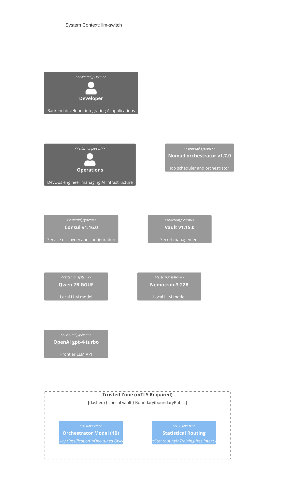

```mermaid
C4Context
    title System Context: llm-switch
    Person_Ext(developer, "Developer", "Backend developer integrating AI applications")
    Person_Ext(operations, "Operations", "DevOps engineer managing AI infrastructure")
    System_Ext(nomad, "Nomad orchestrator v1.7.0", "Job scheduler and orchestrator")
    System_Ext(consul, "Consul v1.16.0", "Service discovery and configuration")
    System_Ext(vault, "Vault v1.15.0", "Secret management")
    System_Ext(localQwen, "Qwen 7B GGUF", "Local LLM model")
    System_Ext(localNemotron, "Nemotron-3-22B", "Local LLM model")
    System_Ext(frontierAPI, "OpenAI gpt-4-turbo", "Frontier LLM API")
    
    Boundary(boundaryTrusted, "Trusted Zone (mTLS Required)", dashed) {
        consul
        vault
    }
    
    Boundary(boundaryPublic, "Public Internet\nTLS 1.3 Termination", solid) {
        frontierAPI
    }
    
    System(llmSwitch, "llm-switch", "Intelligent LLM proxy\nGolang 1.21+, Docker 24.0+") {
        Component(orchestratorModel, "Orchestrator Model (1B)", "Intent and complexity classification\nFine-tuned Qwen 2.5 0.5B-Instruct")
        Component(statisticalRouting, "Statistical Routing", "NormStat/VecStat routing\nTraining-free intent classification")
    }
    
    UpdateLayoutConfig($c4ShapeInRow="3", $c4BoundaryInRow="1")
```