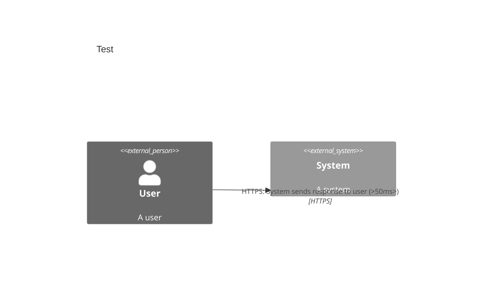

```mermaid
C4Context
    title Test
    Person_Ext(user, "User", "A user")
    System_Ext(system, "System", "A system")
    Rel(user, system, "HTTPS: User sends request to system (<50ms>)", "HTTPS")
    Rel(user, system, "HTTPS: System sends response to user (>50ms>)", "HTTPS")
    UpdateLayoutConfig($c4ShapeInRow="3", $c4BoundaryInRow="1")
```